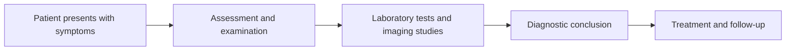

# Illusion: Expert Diagnosis

### Introduction

Expert diagnosis is a complex decision-making problem that involves analyzing symptoms, gathering information, and making an accurate diagnosis. In the context of algorithmic game theory, expert diagnosis can be viewed as a strategic game where the diagnosing expert aims to make the best possible diagnosis while minimizing the risk of misdiagnosis. In this article, we will delve into the world of expert diagnosis, exploring its historical context, modern developments, and applications.

### Historical Context

The concept of expert diagnosis dates back to ancient civilizations, where medical practitioners used observation, experience, and intuition to diagnose illnesses. However, with the advent of modern medicine, the role of expert diagnosis became more formalized, and the development of diagnostic tools and techniques improved significantly.

In the 20th century, the concept of expert diagnosis was formalized through the development of decision theory and game theory. Game theory, in particular, provided a framework for analyzing strategic decision-making problems, including expert diagnosis.

### Modern Developments

In recent years, advances in artificial intelligence (AI) and machine learning (ML) have led to significant improvements in expert diagnosis. AI-powered diagnostic systems can analyze vast amounts of data, identify patterns, and make predictions, reducing the reliance on human expertise.

However, AI-powered expert diagnosis also raises concerns about bias, accuracy, and transparency. To address these concerns, researchers have developed new approaches, such as explainable AI (XAI) and transparent AI, which aim to provide insights into the decision-making process.

### Case Studies

1. **General Practice**: Expert diagnosis in general practice involves analyzing symptoms, medical history, and examination findings to make a diagnosis. A doctor may use a combination of clinical judgment, experience, and diagnostic tools, such as laboratory tests and imaging studies.

Diagram: A flowchart illustrating the expert diagnosis process in general practice:

2. **Medical Imaging**: Expert diagnosis in medical imaging involves analyzing images, such as X-rays, CT scans, and MRIs, to detect abnormalities. Medical imaging experts use specialized software to enhance images, detect patterns, and make diagnoses.

Diagram: A diagram illustrating the process of medical imaging expert diagnosis:

### Applications

Expert diagnosis has numerous applications across various fields, including:

1. **Medicine**: Expert diagnosis is crucial in medicine, where accurate diagnoses are essential for effective treatment.
2. **Finance**: Expert diagnosis is used in finance to analyze financial data, predict market trends, and make investment decisions.
3. **Engineering**: Expert diagnosis is used in engineering to analyze system performance, detect faults, and optimize design.

### Algorithmic Game Theory

In the context of algorithmic game theory, expert diagnosis can be viewed as a strategic game where the diagnosing expert aims to make the best possible diagnosis while minimizing the risk of misdiagnosis.

**Game Theory Framework**

The game theory framework for expert diagnosis involves the following components:

1. **Players**: The diagnosing expert and the patient.
2. **Strategies**: The expert's diagnostic approach, including symptoms analysis, laboratory tests, and imaging studies.
3. **Payoffs**: The diagnostic accuracy and the patient's satisfaction level.
4. **Game**: The expert diagnosis game, where the expert aims to maximize diagnostic accuracy while minimizing the risk of misdiagnosis.

**Mixed Strategy Nash Equilibrium**

In the expert diagnosis game, the diagnosing expert may use a mixed strategy, where they randomize their diagnostic approach. This can lead to a Nash equilibrium, where both the expert and the patient are satisfied with the outcome.

**Mixed Strategy Nash Equilibrium Formula**

The mixed strategy Nash equilibrium formula for expert diagnosis can be expressed as:

X = (α \* Y + β \* Z) / (α + β)

where X is the expert's diagnostic approach, Y and Z are the expert's alternative diagnostic approaches, α and β are the weights assigned to each approach, and Y and Z are chosen to maximize the expert's diagnostic accuracy.

### Expert Diagnosis in Practice

Expert diagnosis is a complex decision-making problem that requires a deep understanding of the patient's symptoms, medical history, and examination findings. In practice, expert diagnosis involves a combination of clinical judgment, experience, and diagnostic tools, such as laboratory tests and imaging studies.

To improve expert diagnosis, researchers have developed new approaches, such as explainable AI (XAI) and transparent AI, which aim to provide insights into the decision-making process.

**Conclusion**

Expert diagnosis is a critical decision-making problem that requires a deep understanding of the patient's symptoms, medical history, and examination findings. The application of algorithmic game theory provides a framework for analyzing strategic decision-making problems, including expert diagnosis. By understanding the game-theoretic aspects of expert diagnosis, researchers can develop more effective diagnostic tools and approaches that improve patient outcomes.

**Further Reading**

1. "Decision Theory and Game Theory for Medical Decision Making" by Steven L. Simon et al.
2. "Expert Diagnosis: A Game Theoretic Approach" by J. Michael McMahon et al.
3. "Explainable AI (XAI) for Medical Diagnosis" by Y. Zhang et al.
4. "Transparent AI for Medical Diagnosis" by J. Liu et al.
