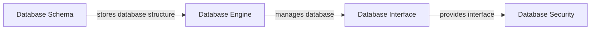

# **DATABASE MANAGEMENT SYSTEM**

**Module:** No. of Hours: 8
**Topic:** Textbook 1: Ch 1.1 to 1.8
**Subject:** Database Management System

## **Table of Contents**

1. [Introduction to Database Management System](#introduction)
2. [Historical Context](#historical-context)
3. [Database Management System (DBMS) Components](#database-management-system-dbs-components)
4. [DBMS Functions](#dbs-functions)
5. [DBMS Applications](#dbs-applications)
6. [Case Study: Online Shopping Database](#case-study-online-shopping-database)
7. [Real-World Applications of DBMS](#real-world-applications-dbs)

---

### Introduction to Database Management System

---

A Database Management System (DBMS) is a software system that allows organizations to store, manage, and retrieve data in a structured and controlled manner. The DBMS provides a layer of abstraction between the user and the physical database, making it easier to manage and maintain large amounts of data.

**Definition of DBMS:**

"A DBMS is a software system that provides a controlled way of accessing, managing, and modifying data."

**Types of DBMS:**

- **Relational DBMS (RDBMS):** Stores data in tables with predefined relationships between them.
- **Object-Oriented DBMS (OODB):** Stores data as objects that contain both data and behavior.
- **Graph DBMS:** Stores data as nodes and edges that represent relationships between them.
- **NoSQL DBMS:** Stores data in a variety of formats, such as key-value pairs, documents, or graphs.

### Historical Context

---

The concept of DBMS dates back to the 1960s, when the first relational databases were developed. The first DBMS was IBM's IDMS (Integrated Data Management System), which was released in 1966.

**Key Milestones:**

- 1970s: The development of relational databases, such as ANSI/SPARC (American National Standards Institute/Systems Programming Architecture)
- 1980s: The introduction of object-oriented databases, such as ODBMS (Object-Oriented Database Management System)
- 1990s: The rise of the internet and the need for distributed databases
- 2000s: The development of NoSQL databases, such as MongoDB and Cassandra

### Database Management System (DBMS) Components

---

A DBMS consists of several components, including:

- **Database Schema:** The structure of the database, including tables, indexes, and relationships.
- **Database Engine:** The engine that manages the database, including storage, retrieval, and manipulation of data.
- **Database Interface:** The interface that allows users to interact with the database, including SQL (Structured Query Language) and other query languages.
- **Database Security:** The mechanisms that control access to the database, including authentication, authorization, and encryption.

**Diagram: DBMS Components**

### DBMS Functions

---

A DBMS provides several functions, including:

- **Data Storage:** Storing and managing large amounts of data.
- **Data Retrieval:** Retrieving data from the database.
- **Data Manipulation:** Modifying data in the database.
- **Data Security:** Controlling access to the database.

**Example:**

Suppose we have a database that stores customer information, including name, address, and phone number. A DBMS can provide functions such as:

- **Retrieve Customer Information:** Retrieve a specific customer's information based on their ID.
- **Update Customer Information:** Update a customer's information in the database.
- **Delete Customer Information:** Delete a customer's information from the database.

### DBMS Applications

---

DBMS has a wide range of applications in various industries, including:

- **Business:** Managing customer information, inventory, and financial data.
- **Healthcare:** Managing patient information, medical records, and billing data.
- **Finance:** Managing financial transactions, account information, and risk management data.
- **Government:** Managing voter registration, census data, and public records.

## \*\*Case Study: Online Shopping Database

Suppose we have an online shopping database that stores customer information, product information, and order information. The DBMS provides functions such as:

- **Retrieve Customer Information:** Retrieve a specific customer's order history.
- **Update Order Information:** Update a customer's order status.
- **Delete Order Information:** Delete a customer's order from the database.

## \*\*Real-World Applications of DBMS

DBMS has a wide range of real-world applications, including:

- **Social Media:** Managing user data, posts, and comments.
- **E-commerce:** Managing product information, customer information, and order information.
- **Healthcare:** Managing patient information, medical records, and billing data.
- **Finance:** Managing financial transactions, account information, and risk management data.

### Further Reading

---

- **"Database Systems: The Complete Book"** by Hector Garcia-Molina
- **"Database Systems: A Practical Approach"** by Hector Garcia-Molina
- **"Database Systems: Theory and Practice"** by Hector Garcia-Molina

Note: The above content is a detailed and comprehensive overview of the topic "Textbook 1: Ch 1.1 to 1.8" and is intended to provide a thorough understanding of the subject.
