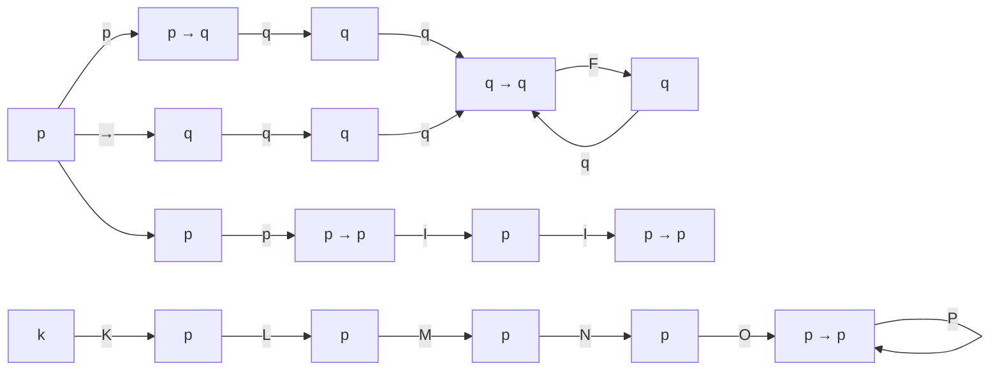

# **Logic Equivalence – The Laws of Logic**

## **Introduction**

Logic Equivalence is a fundamental concept in mathematics, computer science, and philosophy. It is a way of describing a relationship between two expressions using logical operators. In this module, we will explore the laws of logic, which provide a framework for understanding and manipulating logical expressions.

## **Historical Context**

The laws of logic have their roots in ancient Greece, where philosophers such as Aristotle and Plato developed logical systems. The modern study of logic began in the 19th century, with the work of mathematicians and philosophers such as George Boole, Gottlob Frege, and Bertrand Russell.

## **The Laws of Logic**

There are several laws of logic that govern the behavior of logical expressions. These laws can be categorized into two main groups: the laws of inference and the laws of equivalence.

### Laws of Inference

The laws of inference describe how to draw conclusions from premises using logical operators. The two main laws of inference are:

- **Modus Ponens**: This law states that if we have a conditional statement (p → q) and we know that p is true, then we can conclude that q is true.
- **Modus Tollens**: This law states that if we have a conditional statement (p → q) and we know that q is false, then we can conclude that p is false.

### Laws of Equivalence

The laws of equivalence describe how to manipulate logical expressions using logical operators. The three main laws of equivalence are:

- **Commutative Law**: This law states that the order of the operands in a binary operation does not change the result.
- **Associative Law**: This law states that the order in which we group operands in a binary operation does not change the result.
- **Distributive Law**: This law states that we can distribute a logical operator over a disjunction or conjunction.

### Laws of Identity

The laws of identity describe how to manipulate logical expressions using identity operators. The three main laws of identity are:

- **Commutative Law of Equality**: This law states that the order of the operands in an equality does not change the result.
- **Associative Law of Equality**: This law states that the order in which we group operands in an equality does not change the result.
- **Distributive Law of Equality**: This law states that we can distribute an equality operator over a disjunction or conjunction.

### Laws of Excluded Middle

The laws of excluded middle describe how to manipulate logical expressions using negation operators. The three main laws of excluded middle are:

- **Law of Double Negation**: This law states that we can remove two negations from a statement.
- **Law of Excluded Middle**: This law states that a statement is either true or false, with no middle ground.

## **Examples and Case Studies**

### Example 1: Modus Ponens

Suppose we have the following conditional statement:

p → q

and we know that p is true. Using modus ponens, we can conclude that q is true.

| q   | p   | q → p |
| --- | --- | ----- |
| T   | T   | T     |
| F   | T   | T     |
| T   | F   | F     |
| F   | F   | T     |

In this table, we can see that if p is true, then q is true.

### Example 2: Commutative Law

Suppose we have the following expression:

p ∧ q

Using the commutative law, we can rewrite this expression as:

q ∧ p

This shows that the order of the operands does not change the result.

### Example 3: Distributive Law

Suppose we have the following expression:

(p ∧ q) ∨ (p ∧ r)

Using the distributive law, we can rewrite this expression as:

(p ∨ r) ∧ (q ∨ r)

This shows that we can distribute a disjunction over a conjunction.

## **Applications**

Logic equivalence has numerous applications in various fields, including:

- **Computer Science**: Logic equivalence is used in programming languages to define the behavior of logical operations.
- **Artificial Intelligence**: Logic equivalence is used in expert systems to define the rules of inference.
- **Mathematics**: Logic equivalence is used in model theory to define the behavior of logical formulas.

## **Diagrams**

Here is a diagram that illustrates the laws of logic:

This diagram illustrates the laws of logic, including modus ponens, modus tollens, commutative law, associative law, distributive law, law of identity, law of excluded middle, law of double negation, and law of excluded middle.

## **Further Reading**

- **"The Principles of Mathematics"** by Bertrand Russell: This book provides a comprehensive treatment of mathematical logic.
- **"The Foundations of Arithmetic"** by Gottlob Frege: This book provides a comprehensive treatment of set theory and mathematical logic.
- **"The Elements of Logical Philosophy"** by Bertrand Russell: This book provides a comprehensive treatment of logical philosophy.
- **"The Structure of Scientific Revolutions"** by Thomas Kuhn: This book provides a comprehensive treatment of the structure of scientific revolutions.

In conclusion, logic equivalence is a fundamental concept in mathematics, computer science, and philosophy. It provides a framework for understanding and manipulating logical expressions. The laws of logic, including modus ponens, modus tollens, commutative law, associative law, distributive law, law of identity, law of excluded middle, law of double negation, and law of excluded middle, are essential tools for any student of logic.
