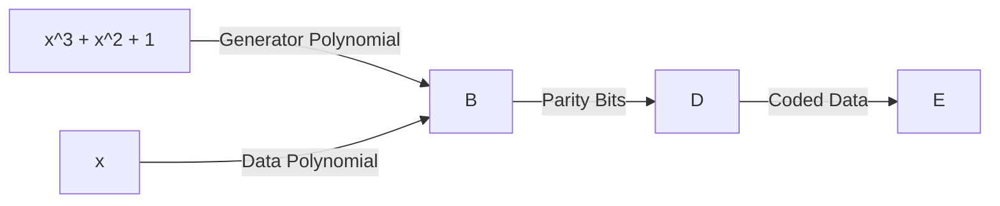

# **12.1 - 12.2: Block Coding and Cyclic Codes**

## **Introduction**

In the realm of error detection and correction, block coding is a crucial technique used to protect data against bit errors that can occur during transmission over a computer network. This chapter delves into the world of block coding, specifically focusing on cyclic codes, which are a type of linear block code. We will explore the history, theory, and applications of block coding, including cyclic codes, and examine the trade-offs between their performance and complexity.

## **Historical Context**

The concept of block coding dates back to the 1940s, when the first error-correcting codes were developed for magnetic tapes. These early codes were simple and limited in their capabilities, but they laid the foundation for more advanced error-correcting techniques. In the 1960s, the development of digital communication systems led to the creation of more sophisticated block codes, including cyclic codes.

## **Block Coding Basics**

A block code is a type of error-correcting code that divides the data into fixed-length blocks and adds redundancy to each block. The redundancy is used to detect and correct errors that occur during transmission. There are two main types of block codes:

1.  **Non-Linear Block Codes**: These codes are based on a non-linear transformation of the data, which means that the output of the encoder is not directly related to the input.
2.  **Linear Block Codes**: These codes are based on a linear transformation of the data, which means that the output of the encoder is directly related to the input.

## **Cyclic Codes**

Cyclic codes are a type of linear block code that have the property that the output of the encoder is cyclic, meaning that adding a cyclic shift to the output does not change its value. This property makes cyclic codes particularly useful for applications where data is transmitted in a circular or cyclic manner.

## **Cyclic Code Basics**

A cyclic code is defined by a generator polynomial, which is used to generate the parity bits added to the data. The generator polynomial is a polynomial that divides the data polynomial, leaving a remainder that represents the parity bits. There are two main types of cyclic codes:

1.  **Minimum Distance Cyclic Codes**: These codes have a minimum distance of at least 3 between any two codewords, which means that they can detect and correct single-bit errors.
2.  **Maximum Distance Cyclic Codes**: These codes have a maximum distance of at least 3 between any two codewords, which means that they can detect and correct single-bit errors.

## **Applications of Cyclic Codes**

Cyclic codes have numerous applications in computer networking, including:

1.  **Error Detection and Correction**: Cyclic codes can be used to detect and correct errors in data transmission, ensuring that data is delivered accurately and reliably.
2.  **Forward Error Correction**: Cyclic codes can be used to forward correct errors, meaning that errors are corrected before they reach the receiver.
3.  **Data Compression**: Cyclic codes can be used to compress data, reducing its size and improving transmission efficiency.
4.  **Cryptography**: Cyclic codes can be used to create secure cryptographic protocols, protecting data from unauthorized access.

## **Case Study: Cyclic Codes in Wireless Networks**

Wireless networks rely heavily on cyclic codes to ensure reliable data transmission. For example, a wireless router may use cyclic codes to detect and correct errors in data transmission, ensuring that data is delivered accurately and reliably. Additionally, cyclic codes can be used to compress data in wireless networks, reducing the amount of data that needs to be transmitted and improving transmission efficiency.

## **Example: Cyclic Code Generator Polynomial**

Suppose we want to generate a cyclic code with a generator polynomial of `g(x) = x^3 + x^2 + 1`. The generator polynomial is used to generate the parity bits added to the data. We can use the following steps to generate the parity bits:

1.  **Divide the data polynomial by the generator polynomial**: Divide the data polynomial by the generator polynomial to leave a remainder that represents the parity bits.
2.  **Extract the parity bits**: Extract the parity bits from the remainder.
3.  **Add the parity bits to the data**: Add the parity bits to the data to form the coded data.

## **Diagram: Cyclic Code Generator Polynomial**

Here is a diagram illustrating the generator polynomial and the process of generating parity bits:

## **Conclusion**

In conclusion, cyclic codes are a type of linear block code that have the property of being cyclic, making them ideal for applications where data is transmitted in a circular or cyclic manner. Cyclic codes have numerous applications in computer networking, including error detection and correction, forward error correction, data compression, and cryptography. This chapter has provided an in-depth introduction to cyclic codes, including their history, theory, and applications. With a deep understanding of cyclic codes, you can better appreciate the complexities of computer networking and the importance of error detection and correction in ensuring reliable data transmission.

## **Further Reading**

1.  **"Error-Correcting Codes" by Richard J. McEliece**: This book provides a comprehensive introduction to error-correcting codes, including cyclic codes.
2.  **"Cyclic Codes and Their Applications" by Jonathan B. Kessler**: This book provides an in-depth examination of cyclic codes and their applications in computer networking.
3.  **"Digital Communication Systems" by John R. Barry, Edward A. Lee, and Donald G. Messerschmitt**: This book provides a comprehensive introduction to digital communication systems, including the use of cyclic codes for error detection and correction.

We hope this detailed content has provided you with a thorough understanding of block coding and cyclic codes. If you have any further questions or need additional clarification, please don't hesitate to ask.
