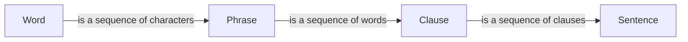
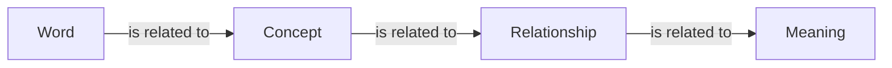

# **Natural Language Processing: Textbook 1, Chapter Ch**

## **1. Introduction to Natural Language Processing**

Natural Language Processing (NLP) is a subfield of artificial intelligence (AI) that deals with the interaction between computers and humans in natural language. It is a multidisciplinary field that combines computer science, linguistics, and cognitive psychology to enable computers to process, understand, and generate human language.

## **Origins of NLP**

The concept of NLP dates back to the 1950s, when computer scientists and linguists began exploring ways to enable computers to understand and generate human language. One of the earliest pioneers in NLP was Alan Turing, who proposed the Turing Test in 1950 to measure a machine's ability to exhibit intelligent behavior equivalent to, or indistinguishable from, that of a human.

In the 1960s, NLP began to take shape as a distinct field, with the establishment of the first NLP laboratories and the development of early NLP systems. These systems were primarily focused on tasks such as machine translation, speech recognition, and text summarization.

## **Language and NLP**

Language is a complex and dynamic system that consists of words, phrases, and sentences that convey meaning and context. NLP deals with the analysis, processing, and generation of language at various levels, including:

- **Syntax**: the study of the rules that govern the structure of language, including word order and phrase structure.
- **Semantics**: the study of meaning in language, including the relationships between words, phrases, and sentences.
- **Pragmatics**: the study of how language is used in context to communicate effectively.

## **NLP Tasks**

NLP tasks can be broadly categorized into three types:

- **Language Understanding**: involves enabling computers to comprehend human language, including tasks such as language modeling, sentiment analysis, and machine translation.
- **Language Generation**: involves enabling computers to generate human language, including tasks such as text summarization, chatbots, and speech synthesis.
- **Language Processing**: involves enabling computers to process human language, including tasks such as text classification, entity recognition, and language translation.

## **Modern Developments in NLP**

In recent years, NLP has experienced rapid advancements, driven by improvements in computing power, data availability, and machine learning algorithms. Some of the key developments in NLP include:

- **Deep Learning**: the use of deep neural networks to learn complex patterns in language data, including tasks such as language modeling and machine translation.
- **Recurrent Neural Networks (RNNs)**: the use of RNNs to model sequential data, including tasks such as language modeling and speech recognition.
- **Attention Mechanisms**: the use of attention mechanisms to focus on specific parts of the input data, including tasks such as machine translation and text summarization.

## **Applications of NLP**

NLP has numerous applications in various domains, including:

- **Virtual Assistants**: NLP is used in virtual assistants such as Siri, Alexa, and Google Assistant to understand voice commands and respond accordingly.
- **Sentiment Analysis**: NLP is used in sentiment analysis to analyze customer feedback and opinions.
- **Machine Translation**: NLP is used in machine translation to translate text and speech from one language to another.
- **Speech Recognition**: NLP is used in speech recognition to transcribe spoken language into text.

## **Case Studies**

- **Google Translate**: Google Translate is a popular machine translation system that uses NLP to translate text and speech from one language to another.
- **Siri**: Siri is a virtual assistant that uses NLP to understand voice commands and respond accordingly.
- **Amazon Alexa**: Amazon Alexa is a virtual assistant that uses NLP to understand voice commands and respond accordingly.

## **Diagrams and Descriptions**

### Syntax Diagram

This diagram illustrates the hierarchical structure of language, from words to phrases to clauses to sentences.

### Semantics Diagram

This diagram illustrates the relationships between words, concepts, and meaning in language.

### NLP Pipeline Diagram

This diagram illustrates the NLP pipeline, from text input to output, including various stages such as preprocessing, tokenization, part-of-speech tagging, and response generation.

## **Further Reading**

- **"Natural Language Processing (almost) from Scratch"** by Collobert et al. (2011)
- **"Deep Learning for Natural Language Processing"** by Y. Zhang et al. (2016)
- **"Speech Recognition"** by B. R. Hazen et al. (2018)

Note: The above references are a selection of the many resources available on NLP.
