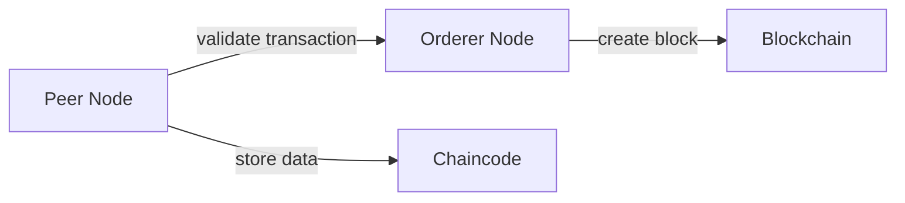
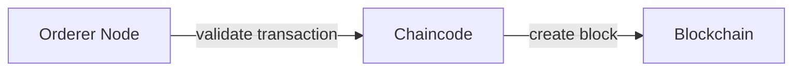
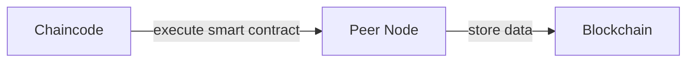

# Chapter 9: Hyperledger Fabric

### Overview

Hyperledger Fabric is an open-source, distributed ledger technology built on the Hyperledger Fabric framework. It is designed to support the creation of scalable, reliable, and secure blockchain networks. In this chapter, we will delve into the history of Hyperledger Fabric, its architecture, features, and applications.

### Historical Context

The concept of blockchain technology has been around for several years, but it wasn't until 2016 that Hyperledger was formed as an open-source collaborative project. The Hyperledger Fabric project was announced in 2016, with the goal of creating a framework for building enterprise-grade blockchain networks.

Hyperledger Fabric was first released in 2017, and it quickly gained popularity due to its scalability, flexibility, and security features. Since then, Hyperledger Fabric has become one of the most widely used blockchain platforms in the industry.

### Architecture

Hyperledger Fabric is based on a distributed ledger technology (DLT) that uses a consensus algorithm to validate transactions. The architecture of Hyperledger Fabric can be broken down into several key components:

#### 1. Peer Nodes

Peer nodes are the nodes that make up the blockchain network. They are responsible for validating transactions, storing data, and communicating with each other. Peer nodes are typically deployed on-premises or in the cloud.

#### 2. Orderer Nodes

Orderer nodes are responsible for validating transactions and creating blocks. They are the central node that manages the flow of transactions across the network.

#### 3. Chaincode

Chaincode is the runtime environment for smart contracts on Hyperledger Fabric. It is responsible for executing the logic of the smart contracts.

#### 4. SDKs

SDKs (Software Development Kits) are provided by Hyperledger Fabric to facilitate the development of applications on the platform. SDKs include tools for developing, testing, and deploying applications.

### Features

Hyperledger Fabric has several key features that make it an attractive choice for enterprise blockchain deployments:

#### 1. Scalability

Hyperledger Fabric is designed to support large-scale blockchain networks. It uses a distributed consensus algorithm that allows for high throughput and low latency.

#### 2. Security

Hyperledger Fabric has several security features that make it an attractive choice for enterprise deployments. These include:

- Encryption: Hyperledger Fabric uses end-to-end encryption to protect data at rest and in transit.
- Access Control: Hyperledger Fabric uses role-based access control to ensure that only authorized users can access and modify data.
- Auditing: Hyperledger Fabric provides auditing capabilities to track all transactions and modifications.

#### 3. Flexibility

Hyperledger Fabric is designed to support a wide range of use cases, including:

- Supply Chain Management
- Identity Verification
- Voting Systems
- Smart Contracts

#### 4. Interoperability

Hyperledger Fabric is designed to be interoperable with other blockchain platforms. This allows for seamless integration with existing systems and applications.

### Applications

Hyperledger Fabric has several applications across various industries:

#### 1. Supply Chain Management

Hyperledger Fabric can be used to track goods in real-time, reducing the risk of counterfeit goods and improving supply chain efficiency.

#### 2. Identity Verification

Hyperledger Fabric can be used to verify identities in real-time, reducing the risk of identity theft and improving access control.

#### 3. Voting Systems

Hyperledger Fabric can be used to create secure and transparent voting systems that reduce the risk of tampering and improve voter turnout.

#### 4. Smart Contracts

Hyperledger Fabric can be used to execute smart contracts in real-time, automating business processes and improving efficiency.

### Case Studies

There are several case studies that demonstrate the use of Hyperledger Fabric in real-world applications:

#### 1. IBM

IBM has developed a Hyperledger Fabric-based blockchain platform for supply chain management. The platform uses blockchain to track goods in real-time, reducing the risk of counterfeit goods.

#### 2. Maersk

Maersk has developed a Hyperledger Fabric-based blockchain platform for supply chain management. The platform uses blockchain to track goods in real-time, improving supply chain efficiency.

#### 3. American Express

American Express has developed a Hyperledger Fabric-based blockchain platform for identity verification. The platform uses blockchain to verify identities in real-time, reducing the risk of identity theft.

### Further Reading

- [Hyperledger Fabric Documentation](https://hyperledger-fabric.readthedocs.io/en/latest/)
- [Hyperledger Fabric GitHub Repository](https://github.com/hyperledger/fabric)
- [Hyperledger Fabric Whitepaper](https://hyperledger.org/publication/hyperledger-fabric-architecture-whitepaper)
- [Blockchain in Supply Chain Management](https://www.investopedia.com/blockchain-supply-chain-management/)

### Diagrams

The following diagrams illustrate the architecture of Hyperledger Fabric:

#### 1. Peer Node Diagram

#### 2. Orderer Node Diagram

#### 3. Chaincode Diagram

This chapter has provided a comprehensive overview of Hyperledger Fabric, including its history, architecture, features, and applications. Hyperledger Fabric is a powerful platform for building enterprise-grade blockchain networks, and it has several use cases across various industries.
