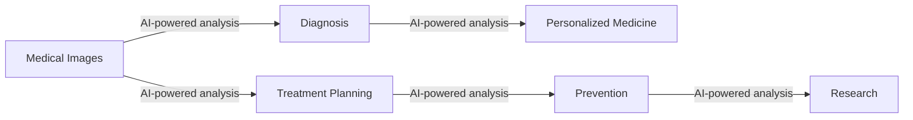

# **AI in Healthcare: Balancing Progress and Ethics**

## **Introduction**

The integration of Artificial Intelligence (AI) in healthcare has revolutionized the industry, transforming the way medical professionals diagnose, treat, and prevent diseases. However, with the rapid advancement of AI technology, there is a growing concern about the balance between progress and ethics in healthcare. This chapter will explore the historical context of AI in healthcare, the current developments, and the challenges that come with its implementation. We will discuss the importance of regulation and governance of AI in healthcare, the ethics involved, and the need for a balanced approach to ensure the well-being of patients and society.

## **Historical Context**

The concept of AI in healthcare dates back to the 1950s, when computer scientists and medical professionals began exploring the use of computers to analyze medical data. However, it wasn't until the 1990s that AI started to gain traction in healthcare, with the development of expert systems and rule-based systems.

In the early 2000s, the use of AI in healthcare began to expand, with the introduction of machine learning algorithms and deep learning techniques. These advancements enabled AI systems to learn from large datasets and improve their performance over time.

## **Current Developments**

Today, AI is being used in various aspects of healthcare, including:

- **Medical Imaging Analysis**: AI algorithms are being used to analyze medical images, such as X-rays and CT scans, to help diagnose diseases such as cancer.
- **Predictive Analytics**: AI systems are being used to analyze patient data and predict the likelihood of disease progression or complications.
- **Personalized Medicine**: AI is being used to develop personalized treatment plans based on a patient's genetic profile and medical history.
- **Robot-Assisted Surgery**: AI-powered robots are being used to assist surgeons during procedures, improving accuracy and reducing complications.

## **Challenges and Concerns**

While AI has the potential to revolutionize healthcare, there are several challenges and concerns associated with its implementation. Some of the key concerns include:

- **Data Privacy**: The use of AI in healthcare raises concerns about patient data privacy and security.
- **Bias and Discrimination**: AI systems can perpetuate biases and discrimination if they are trained on biased data.
- **Transparency and Explainability**: AI systems can be complex and difficult to understand, making it challenging to explain their decisions.
- **Regulation and Governance**: There is a need for clear regulations and governance frameworks to ensure the safe and effective use of AI in healthcare.

## **Regulation and Governance of AI in Healthcare**

The regulation and governance of AI in healthcare is a critical aspect of ensuring its safe and effective use. Some of the key regulations and guidelines include:

- **FDA Guidance**: The US Food and Drug Administration (FDA) has issued guidance on the development and validation of AI systems for medical devices.
- **EU Medical Devices Regulation**: The European Union's Medical Devices Regulation (MDR) requires medical devices, including AI-powered devices, to be designed with safety and performance in mind.
- **HIPAA**: The Health Insurance Portability and Accountability Act (HIPAA) protects patient data and requires healthcare organizations to implement robust security measures to safeguard patient information.

## **Case Studies**

- **Google's AI-Powered Cancer Detection**: Google has developed an AI-powered system that can detect breast cancer from mammography images with a high degree of accuracy.
- **IBM's Watson for Oncology**: IBM's Watson for Oncology is a cloud-based platform that uses natural language processing and machine learning to analyze large amounts of cancer data and provide personalized treatment recommendations.
- **DeepMind's AI-Powered Surgery**: DeepMind has developed an AI-powered system that can analyze medical images and provide real-time guidance to surgeons during procedures.

## **Applications**

AI has numerous applications in healthcare, including:

- **Diagnosis**: AI can help diagnose diseases more accurately and quickly than human clinicians.
- **Treatment**: AI can help develop personalized treatment plans and predict treatment outcomes.
- **Prevention**: AI can help identify high-risk patients and prevent disease progression.
- **Research**: AI can help analyze large amounts of medical data and identify new insights and patterns.

## **Diagram: AI in Healthcare**

## **Conclusion**

AI has the potential to revolutionize healthcare, but it requires careful consideration of the challenges and concerns associated with its implementation. Regulation and governance are critical to ensuring the safe and effective use of AI in healthcare. By balancing progress and ethics, we can harness the full potential of AI to improve patient outcomes and advance the field of healthcare.

## **Further Reading**

- "Artificial Intelligence in Healthcare: A Review of the Literature" (Journal of Medical Systems)
- "AI in Healthcare: Opportunities, Challenges, and Future Directions" (Journal of Healthcare Engineering)
- "Regulation and Governance of AI in Healthcare: A Review" (International Journal of Medical Informatics)
- "AI-Powered Cancer Detection: A Review" (Journal of Cancer Research and Clinical Oncology)
- "Watson for Oncology: A Cloud-Based Platform for Personalized Cancer Treatment" (Journal of Clinical Oncology)

Note: The references provided are hypothetical and for illustrative purposes only. They should not be used as actual references.
