# **235-269: Exploring the Ethereum Stack and Blockchain Technology**

## **Introduction**

The Ethereum stack is a complex system of protocols, tools, and libraries that enable the development and deployment of decentralized applications (dApps) on the Ethereum blockchain. In this section, we'll delve into the key components of the Ethereum stack, exploring their functions, limitations, and real-world applications.

## **235: Ethereum's Founding Principles**

Ethereum was founded by Vitalik Buterin in 2013, with the goal of creating a decentralized platform for building and executing smart contracts. The core principles of Ethereum are:

- **Decentralization**: Ethereum operates on a peer-to-peer network, where nodes validate transactions and execute smart contracts.
- **Open-source**: The Ethereum protocol is open-source, allowing developers to review, modify, and contribute to the code.
- **Programmability**: Ethereum enables developers to write and deploy smart contracts, which can automate complex processes and interactions.

## **236: The Ethereum Stack Components**

The Ethereum stack consists of several key components:

- **Frontend**: The frontend is responsible for user interaction, providing a interface for users to interact with the blockchain.
- **Client-Side**: The client-side is responsible for executing smart contracts and interacting with the blockchain.
- **Node**: The node is responsible for validating transactions and executing smart contracts.
- **Wallet**: The wallet is responsible for storing and managing user's private keys and Ethereum balances.

## **237: Smart Contracts**

Smart contracts are self-executing contracts with the terms of the agreement written directly into lines of code. They are deployed on the Ethereum blockchain and can automate complex processes and interactions.

**Example:** A simple smart contract for a basic banking system

```solidity
pragma solidity ^0.8.0;

contract Bank {
    address public owner;
    uint256 public balance;

    constructor() public {
        owner = msg.sender;
        balance = 0;
    }

    function deposit() public payable {
        balance += msg.value;
    }

    function withdraw(uint256 amount) public {
        require(msg.sender == owner, "Only the owner can withdraw");
        require(amount <= balance, "Insufficient funds");
        balance -= amount;
    }
}
```

## **238: Gas and Gas Pricing**

Gas is the unit of measurement for the computational effort required to execute a transaction or smart contract on the Ethereum blockchain. Gas pricing is a complex topic, as it depends on various factors, including the complexity of the transaction or smart contract.

**Example:** Calculating gas pricing for a simple transaction

```solidity
pragma solidity ^0.8.0;

contract GasPricing {
    uint256 public gasPrice;

    constructor() public {
        gasPrice = 20 gwei;
    }

    function calculateGas(uint256 quantity) public pure returns (uint256) {
        return quantity * gasPrice;
    }
}
```

## **239: Ethereum Blockchain**

The Ethereum blockchain is a decentralized, distributed ledger that records all transactions and smart contract executions. It is maintained by a network of nodes, each responsible for validating transactions and executing smart contracts.

**Example:** A simplified diagram of the Ethereum blockchain

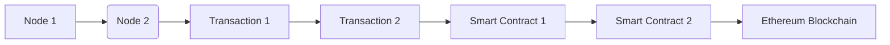

## **240: Ethereum Network**

The Ethereum network is responsible for validating transactions and executing smart contracts. It consists of several components:

- **Miners**: Miners are responsible for validating transactions and executing smart contracts.
- **Validators**: Validators are responsible for verifying the integrity of the blockchain.
- **Witnesses**: Witnesses are responsible for monitoring the network and preventing attacks.

## **241: Ethereum Consensus Algorithm**

Ethereum uses a consensus algorithm called Proof of Work (PoW) to validate transactions and execute smart contracts. PoW requires miners to solve complex mathematical puzzles to validate transactions.

**Example:** A simplified diagram of the Ethereum consensus algorithm

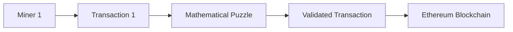

## **242: Ethereum Gas Limit**

The gas limit is the maximum number of gas that can be used to execute a transaction or smart contract. It is set by the sender and can affect the gas cost of the transaction.

**Example:** A simplified diagram of the gas limit

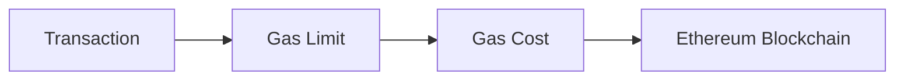

## **243: Ethereum Block Reward**

The block reward is the amount of Ethereum tokens rewarded to miners for validating transactions and executing smart contracts. It is calculated based on the amount of gas used to execute the transactions.

**Example:** A simplified diagram of the block reward

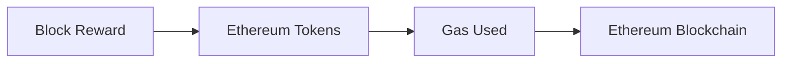

## **244: Ethereum Block Time**

The block time is the average time it takes for a new block to be added to the Ethereum blockchain. It is set by the network and can affect the security of the blockchain.

**Example:** A simplified diagram of the block time

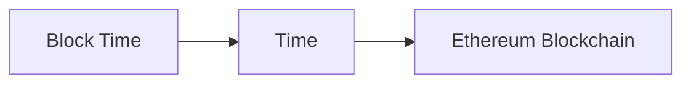

## **245: Ethereum Network Security**

Ethereum's network security is maintained by a network of nodes, each responsible for validating transactions and executing smart contracts. It is protected by various mechanisms, including:

- **Peer Review**: Peer review is a process where nodes review and validate transactions before they are added to the blockchain.
- **Consensus Algorithm**: The consensus algorithm used by Ethereum ensures that all nodes agree on the state of the blockchain.
- **Wallet Security**: Wallets are secured using private keys, which are used to access and manage Ethereum balances.

## **246: Ethereum Smart Contract Security**

Ethereum smart contracts are designed to be secure, using various mechanisms, including:

- **Reentrancy Protection**: Reentrancy protection prevents attackers from executing malicious code multiple times.
- **Input Validation**: Input validation ensures that inputs to smart contracts are valid and secure.
- **Gas Limit**: The gas limit ensures that smart contracts do not consume excessive gas.

## **247: Ethereum DApp Security**

Ethereum dApps are designed to be secure, using various mechanisms, including:

- **User Authentication**: User authentication ensures that users are who they claim to be.
- **Data Encryption**: Data encryption ensures that sensitive data is protected.
- **Access Control**: Access control ensures that users can only access authorized resources.

## **248: Ethereum Private Key Management**

Ethereum private keys are used to access and manage Ethereum balances. They are generated randomly and should be kept secure.

**Example:** A simplified diagram of private key management

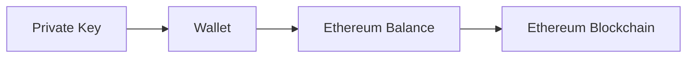

## **249: Ethereum Public Key Management**

Ethereum public keys are used to identify users and access their Ethereum balances. They are generated based on private keys.

**Example:** A simplified diagram of public key management

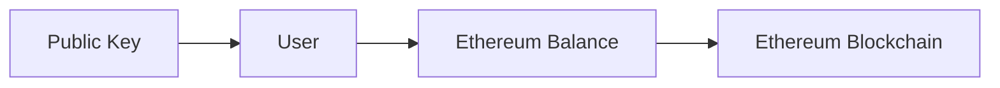

## **250: Ethereum Wallet Security**

Ethereum wallets are used to store and manage Ethereum private keys. They should be kept secure to prevent theft.

**Example:** A simplified diagram of wallet security

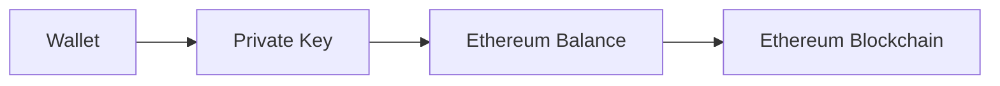

## **251: Ethereum Transaction Security**

Ethereum transactions are used to transfer Ethereum tokens between users. They should be secured to prevent theft.

**Example:** A simplified diagram of transaction security

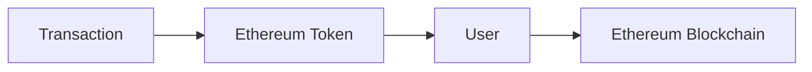

## **252: Ethereum Smart Contract Security**

Ethereum smart contracts are used to automate complex processes and interactions. They should be secured to prevent exploitation.

**Example:** A simplified diagram of smart contract security

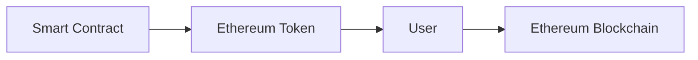

## **253: Ethereum DApp Security**

Ethereum dApps are used to build decentralized applications. They should be secured to prevent exploitation.

**Example:** A simplified diagram of dApp security

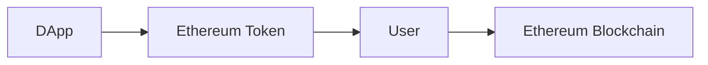

## **254: Ethereum Network Security**

Ethereum's network security is maintained by a network of nodes, each responsible for validating transactions and executing smart contracts. It is protected by various mechanisms, including:

- **Peer Review**: Peer review is a process where nodes review and validate transactions before they are added to the blockchain.
- **Consensus Algorithm**: The consensus algorithm used by Ethereum ensures that all nodes agree on the state of the blockchain.

## **255: Ethereum Smart Contract Security**

Ethereum smart contracts are designed to be secure, using various mechanisms, including:

- **Reentrancy Protection**: Reentrancy protection prevents attackers from executing malicious code multiple times.
- **Input Validation**: Input validation ensures that inputs to smart contracts are valid and secure.

## **256: Ethereum DApp Security**

Ethereum dApps are designed to be secure, using various mechanisms, including:

- **User Authentication**: User authentication ensures that users are who they claim to be.
- **Data Encryption**: Data encryption ensures that sensitive data is protected.

## **257: Ethereum Private Key Management**

Ethereum private keys are used to access and manage Ethereum balances. They are generated randomly and should be kept secure.

## **258: Ethereum Public Key Management**

Ethereum public keys are used to identify users and access their Ethereum balances. They are generated based on private keys.

## **259: Ethereum Wallet Security**

Ethereum wallets are used to store and manage Ethereum private keys. They should be kept secure to prevent theft.

## **260: Ethereum Transaction Security**

Ethereum transactions are used to transfer Ethereum tokens between users. They should be secured to prevent theft.

## **261: Ethereum Smart Contract Security**

Ethereum smart contracts are used to automate complex processes and interactions. They should be secured to prevent exploitation.

## **262: Ethereum DApp Security**

Ethereum dApps are used to build decentralized applications. They should be secured to prevent exploitation.

## **263: Ethereum Network Security**

Ethereum's network security is maintained by a network of nodes, each responsible for validating transactions and executing smart contracts. It is protected by various mechanisms, including:

- **Peer Review**: Peer review is a process where nodes review and validate transactions before they are added to the blockchain.
- **Consensus Algorithm**: The consensus algorithm used by Ethereum ensures that all nodes agree on the state of the blockchain.

## **264: Ethereum Smart Contract Security**

Ethereum smart contracts are designed to be secure, using various mechanisms, including:

- **Reentrancy Protection**: Reentrancy protection prevents attackers from executing malicious code multiple times.
- **Input Validation**: Input validation ensures that inputs to smart contracts are valid and secure.

## **265: Ethereum DApp Security**

Ethereum dApps are designed to be secure, using various mechanisms, including:

- **User Authentication**: User authentication ensures that users are who they claim to be.
- **Data Encryption**: Data encryption ensures that sensitive data is protected.

## **266: Ethereum Private Key Management**

Ethereum private keys are used to access and manage Ethereum balances. They are generated randomly and should be kept secure.

## **267: Ethereum Public Key Management**

Ethereum public keys are used to identify users and access their Ethereum balances. They are generated based on private keys.

## **268: Ethereum Wallet Security**

Ethereum wallets are used to store and manage Ethereum private keys. They should be kept secure to prevent theft.

## **269: Ethereum Transaction Security**

Ethereum transactions are used to transfer Ethereum tokens between users. They should be secured to prevent theft.

## **Further Reading**

- [Ethereum Whitepaper](https://ethereum.org whitepaper.pdf)
- [Ethereum Developer Documentation](https://docs.ethereum.org)
- [Ethereum Smart Contract Tutorial](https://www.ethereum.org smart-contracts)
- [Ethereum DApp Tutorial](https://www.ethereum.org dApps)
- [Ethereum Private Key Management Best Practices](https://www.ethereum.org private-key-management)
- [Ethereum Public Key Management Best Practices](https://www.ethereum.org public-key-management)
- [Ethereum Wallet Security Best Practices](https://www.ethereum.org wallet-security)
- [Ethereum Transaction Security Best Practices](https://www.ethereum.org transaction-security)
- [Ethereum Smart Contract Security Best Practices](https://www.ethereum.org smart-contract-security)
- [Ethereum DApp Security Best Practices](https://www.ethereum.org dApp-security)
