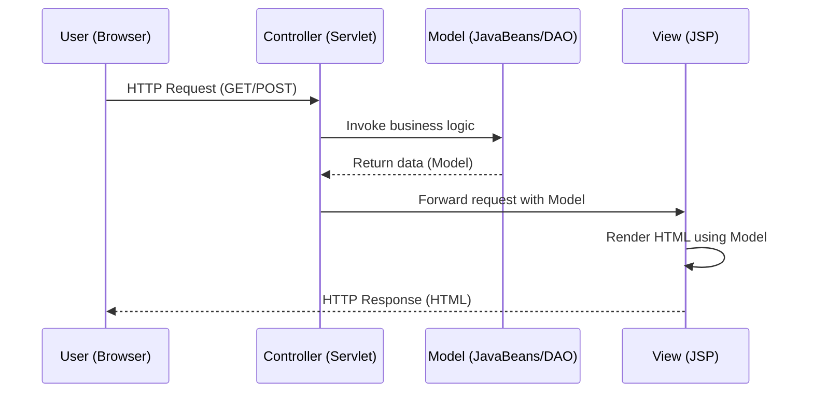

# Model-View-Controller (MVC) Architecture

## Overview

The Model-View-Controller (MVC) pattern is a fundamental architectural design pattern that separates an application into three interconnected components. This separation of concerns promotes modularity, maintainability, and testability in software systems. Originally formulated for Smalltalk-80, MVC has become the standard architectural paradigm for building enterprise-level Java web applications.

## Theoretical Foundation

MVC enforces the principle of **separation of concerns**, where each component has a distinct responsibility:

- **Model**: Represents the application's data and business logic. It is independent of both the view and controller, enabling data reuse across multiple representations.

- **View**: Responsible for rendering the user interface and displaying data from the model. It observes the model for changes but does not contain application logic.

- **Controller**: Acts as an intermediary between the user and the system. It processes user input, invokes appropriate model operations, and selects the corresponding view for rendering.

### Theorem: Benefits of MVC Separation

**Proof**: Consider an application where the presentation layer (View) is tightly coupled with business logic (Model). Any change in data representation requires modifications in both components, violating the **Open-Closed Principle**. MVC decouples these concerns, allowing:

1. Independent development of each layer
2. Multiple views of the same model
3. Simplified unit testing through dependency injection
4. Parallel development by different teams

∎

## MVC Flow in Web Applications

The following sequence diagram illustrates the HTTP request-response cycle in an MVC-based web application:



### Step-by-Step Flow Analysis

1. **Request Reception**: The Controller (typically a Servlet) receives the HTTP request from the client browser. The request contains parameters, session data, or path information.

2. **Model Processing**: The Controller invokes appropriate methods on the Model layer (JavaBeans, DAOs, or service classes). The Model performs business logic operations and retrieves/persists data.

3. **Data Return**: The Model returns processed data to the Controller, typically as a collection of objects or a single domain object.

4. **View Selection**: The Controller selects an appropriate View (JSP) and forwards the request along with the Model data.

5. **Rendering**: The View accesses the Model data (using JSP EL, JSTL, or scriptlets) and renders the final HTML response.

6. **Response**: The rendered HTML is sent back to the client's browser for display.

## Implementation Components

### The Controller (Servlet)

The Controller servlet acts as the entry point and coordinator:

```java
@WebServlet("/students")
public class StudentController extends HttpServlet {
 protected void doGet(HttpServletRequest request,
 HttpServletResponse response)
 throws ServletException, IOException {
 StudentService service = new StudentService();
 List<Student> students = service.getAllStudents();
 request.setAttribute("studentList", students);
 RequestDispatcher view = request.getRequestDispatcher("students.jsp");
 view.forward(request, response);
 }
}
```

### The Model (JavaBeans/DAO)

The Model encapsulates business logic and data:

```java
public class Student {
 private int id;
 private String name;
 private String email;
 // Getters, setters, and business methods
}

public class StudentService {
 public List<Student> getAllStudents() {
 StudentDAO dao = new StudentDAO();
 return dao.findAll();
 }
}
```

### The View (JSP)

The View renders the UI using Model data:

```jsp
<%@ taglib uri="http://java.sun.com/jsp/jstl/core" prefix="c" %>
<table>
 <c:forEach var="student" items="${studentList}">
 <tr>
 <td>${student.name}</td>
 <td>${student.email}</td>
 </tr>
 </c:forEach>
</table>
```

## Advantages of MVC Architecture

| Aspect                   | Benefit                                           |
| ------------------------ | ------------------------------------------------- |
| **Maintainability**      | Changes in one layer don't affect others          |
| **Testability**          | Components can be unit tested independently       |
| **Reusability**          | Models can serve multiple views                   |
| **Parallel Development** | Teams can work on different layers simultaneously |
| **Scalability**          | Easier to add new features and components         |

## Relationship to Modern Frameworks

The MVC pattern serves as the foundation for advanced Java frameworks:

- **Spring MVC**: Extends the classic MVC with dependency injection and annotation-based configuration
- **JSF (JavaServer Faces)**: Component-based MVC framework
- **Struts**: Action-based MVC framework

Understanding classical MVC is essential for comprehending these frameworks' internal workings and design decisions.

## Conclusion

The MVC architectural pattern provides a robust foundation for building maintainable, scalable, and testable web applications. By separating data management, presentation, and control flow, developers can create complex systems that are easier to understand, modify, and extend. This pattern remains relevant as the basis for modern Java web frameworks and enterprise application development.
