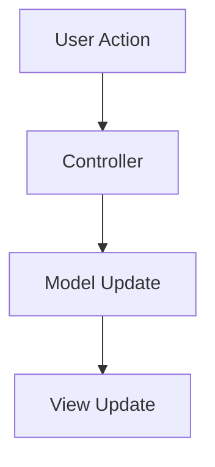

# Two Key Swing Features

## Introduction

Swing, Java's powerful GUI toolkit, introduces two fundamental architectural features that revolutionized desktop application development: the **Delegation Event Model** and **Model-View-Controller (MVC) Architecture**. These features address critical challenges in GUI programming - responsive user interaction and maintainable code structure.

The Delegation Event Model establishes a clean separation between event generation and handling, enabling efficient management of user interactions. Unlike the primitive polling mechanism used in early GUI systems, this model uses an observer pattern approach where components (event sources) delegate event processing to specialized handlers (listeners).

The MVC architecture separates application logic into three distinct layers:

- Model (data and business logic)
- View (visual representation)
- Controller (handles user input)

This separation enables modular development, easier maintenance, and better testability. In Swing, most components implement a simplified MVC variation called the **Separable Model Architecture**, where each component has a model that manages its state.

These features are crucial for developing professional applications that require:

1. Responsive interfaces with complex user interactions
2. Maintainable codebases that can evolve with requirements
3. Consistent behavior across different platforms
4. Reusable UI components

## Core Concepts

### 1. Delegation Event Model

**Definition:** A design pattern where event sources delegate event handling to listener objects.

**Key Components:**

- Event Source: Component generating events (e.g., JButton)
- Event Object: Encapsulates event details (e.g., ActionEvent)
- Event Listener: Interface defining handling methods (e.g., ActionListener)

**Event Processing Flow:**

```
[User Action] → [Event Source] → [Event Object] → [Registered Listeners]
```

**Example Registration:**

```java
JButton btn = new JButton("Click");
btn.addActionListener(new ActionListener() {
 public void actionPerformed(ActionEvent e) {
 System.out.println("Button clicked!");
 }
});
```

### 2. Model-View-Controller (MVC)

**Swing Implementation:**

- Model: Stores component's state (e.g., ButtonModel)
- View: Handles visual presentation (e.g., BasicButtonUI)
- Controller: Managed by look-and-feel implementation

**Advantages:**

- Multiple views can use the same model
- UI changes don't affect business logic
- Easier state management

**Swing's Variation:**



## Detailed Analysis

### Delegation Event Model in Depth

**Event Hierarchy:**

```
java.util.EventObject
 └─ java.awt.AWTEvent
 └─ javax.swing.event.ChangeEvent
 └─ java.awt.event.ActionEvent
 └─ [Other specialized events]
```

**Listener Registration Methods:**
| Component | Listener Type | Registration Method |
|-------------|----------------------|---------------------------|
| JButton | ActionListener | addActionListener() |
| JSlider | ChangeListener | addChangeListener() |
| JTextField | DocumentListener | getDocument().addDocumentListener() |

**Key Principles:**

1. **Decoupling:** Sources and listeners are independent
2. **Multicasting:** Single event can trigger multiple listeners
3. **Event Queuing:** Events are processed in EDT (Event Dispatch Thread)

### MVC Implementation in Swing

**Component Architecture:**

```java
// Typical Swing component structure
public class JComponent extends Container {
 protected ComponentUI ui; // View
 protected Model model; // Model
 // Controller logic embedded in UI delegate
}
```

**Example: JTable Implementation**

```java
JTable table = new JTable();
TableModel model = new DefaultTableModel(data, columns);
table.setModel(model); // Separation of data and presentation
```

## Examples

### Example 1: Event Handling System

**Scenario:** User login form with validation

```java
public class LoginForm extends JFrame {
 private JTextField usernameField;
 private JPasswordField passwordField;

 public LoginForm() {
 // Component initialization
 JButton loginButton = new JButton("Login");
 loginButton.addActionListener(new LoginHandler());

 // Add components to frame...
 }

 class LoginHandler implements ActionListener {
 public void actionPerformed(ActionEvent e) {
 String user = usernameField.getText();
 char[] pass = passwordField.getPassword();

 if(authenticate(user, pass)) {
 JOptionPane.showMessageDialog(this, "Login Successful!");
 } else {
 JOptionPane.showMessageDialog(this, "Invalid Credentials",
 "Error", JOptionPane.ERROR_MESSAGE);
 }
 }
 }
}
```

**Key Points:**

1. Separate listener class improves maintainability
2. Event object carries context (source, timestamps)
3. EDT ensures thread-safe UI updates

### Example 2: MVC-Based Inventory System

**Model:**

```java
public class InventoryModel {
 private List<Product> products;

 public void addProduct(Product p) {
 products.add(p);
 fireDataChanged(); // Notify views
 }
}
```

**View:**

```java
public class InventoryView extends JPanel {
 private JTable productTable;

 public void setModel(InventoryModel model) {
 productTable.setModel(new InventoryTableModel(model));
 }
}
```

**Controller:**

```java
public class InventoryController {
 public void addProduct(String name, double price) {
 model.addProduct(new Product(name, price));
 }
}
```

## Real-World Applications

1. **Financial Trading Platforms:**

- MVC separates market data (Model) from charting (View)
- Complex event handling for real-time updates

2. **Hospital Management Systems:**

- Patient data model shared across multiple views
- Event-driven medication alerts

3. **CAD Software:**

- MVC maintains consistency between 3D model and properties panel
- Mouse motion events for object manipulation

## Exam Tips

1. **Event Handling:**

- Remember the three key components: Source, Event, Listener
- Always implement listener interfaces completely
- Use anonymous classes for simple handlers:

```java
button.addActionListener(e -> handleClick());
```

2. **MVC Patterns:**

- Identify model classes in Swing components:
- JSlider → BoundedRangeModel
- JProgressBar → DefaultBoundedRangeModel
- For state management questions, focus on model separation

3. **Thread Safety:**

- All UI updates must happen on Event Dispatch Thread
- Use SwingUtilities.invokeLater() for background tasks

4. **Design Advantages:**

- Event delegation enables multiple listeners per component
- MVC facilitates skinning/theming through view separation

5. **Common Pitfalls:**

- Forgetting to register listeners
- Modifying models from non-EDT threads
- Tight coupling between view and controller

6. ** Favorite Questions:**

- Compare Swing's event model with AWT
- Draw and explain MVC architecture diagram
- Implement observer pattern using Swing events

7. **Key Methods to Remember:**

- Event registration: addXXXListener()
- Model accessors: getModel(), setModel()
- Event helper methods: getSource(), getWhen()

## Diagrams (Textual Description)

**Delegation Event Model Flow:**

```
[User clicks button]
→ JButton (source) creates ActionEvent
→ Event dispatched to EventQueue
→ EDT processes event
→ ActionListeners' actionPerformed() called
→ Handlers execute business logic
```

**MVC Component Relationships:**

```
Model (Data State)
 ↑ Updates
View (UI Presentation)
 ↑ Notifies
Controller (User Input)
 ↑ Modifies
Model
```
