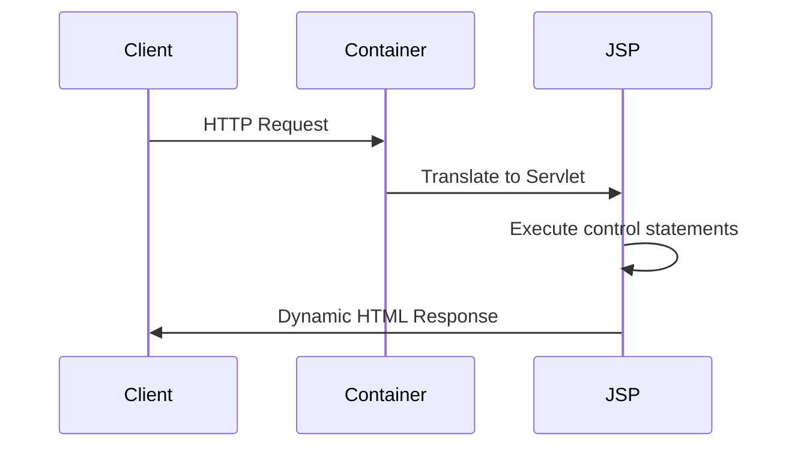

# JSP Control Statements

## Introduction to Control Flow in JSP

Java Server Pages (JSP) control statements enable dynamic content generation by embedding Java-like control structures directly within HTML pages. Unlike standalone Java applications, JSP control flow operates in a web context where decisions and repetitions are often based on:

- HTTP request parameters
- Session attributes
- Database query results
- User authentication status

These statements execute on the server before the final HTML is sent to the client, making them essential for:

1. Conditional rendering of UI components
2. Iterative display of datasets
3. Form validation workflows
4. Personalization based on user sessions

JSP provides three implementation approaches for control flow:

```jsp
<%-- Traditional Scriptlets --%>
<% if(user.isAdmin()) { %>
 <button>Admin Panel</button>
<% } %>

<%-- Expression Language (EL) --%>
${param.showDetails ? 'Displaying Details' : 'Summary View'}

<%-- JSTL Tags --%>
<c:forEach items="${products}" var="product">
 <p>${product.name}</p>
</c:forEach>
```

## Core JSP Control Mechanisms

### 1. Scriptlet-Based Control Flow

Embed Java code directly using `<% %>` tags:

#### Conditional Rendering

```jsp
<%
 String userType = (String) session.getAttribute("userType");
 if("premium".equals(userType)) {
%>
 <div class="premium-banner">Exclusive Content</div>
<%
 } else {
%>
 <div class="upgrade-prompt">Upgrade to Premium</div>
<%
 }
%>
```

#### Looping Constructs

```jsp
<table>
<%
 List<Product> inventory = (List<Product>) request.getAttribute("inventory");
 for(Product item : inventory) {
%>
 <tr>
 <td><%= item.getId() %></td>
 <td><%= item.getName() %></td>
 </tr>
<%
 }
%>
</table>
```

### 2. JSTL Control Tags (Modern Approach)

Java Standard Tag Library provides XML-style tags for control flow:

#### Conditional Operations

```jsp
<c:if test="${not empty sessionScope.cart}">
 <p>Items in cart: ${fn:length(sessionScope.cart)}</p>
</c:if>

<c:choose>
 <c:when test="${param.page == 'home'}">
 <jsp:include page="home.jsp"/>
 </c:when>
 <c:when test="${param.page == 'dashboard'}">
 <jsp:include page="dashboard.jsp"/>
 </c:when>
 <c:otherwise>
 <jsp:include page="404.jsp"/>
 </c:otherwise>
</c:choose>
```

#### Iteration Tags

```jsp
<c:forEach var="i" begin="1" end="5">
 Iteration ${i}<br>
</c:forEach>

<c:forTokens items="apple,banana,mango" delims="," var="fruit">
 <p>${fruit}</p>
</c:forTokens>
```

## Key Architectural Components

### Implicit Objects in Control Flow

JSP provides these pre-defined variables for web-specific operations:

| Object   | Type                | Common Use in Control Flow                   |
| -------- | ------------------- | -------------------------------------------- |
| request  | HttpServletRequest  | `if(request.getParameter("mode") != null)`   |
| response | HttpServletResponse | Redirect control `response.sendRedirect()`   |
| session  | HttpSession         | User-specific logic `session.getAttribute()` |
| out      | JspWriter           | Conditional output `out.print()`             |

### Control Flow Diagram

A typical JSP control flow process:

1. Client sends HTTP request
2. Container translates JSP to servlet
3. Control statements execute during \_jspService()
4. Dynamic HTML generation
5. Final output sent to client



## Practical Examples

### Example 1: Role-Based Access Control

```jsp
<%@ page import="com.example.User" %>
<%
 User currentUser = (User) session.getAttribute("user");
 if(currentUser == null) {
%>
 <jsp:include page="login.jsp"/>
<%
 } else if(currentUser.isAdmin()) {
%>
 <jsp:include page="admin-dashboard.jsp"/>
<%
 } else {
%>
 <jsp:include page="user-dashboard.jsp"/>
<%
 }
%>
```

**Step-by-Step Explanation:**

1. Import User class from application package
2. Retrieve user object from session
3. First condition checks for unauthenticated users
4. Nested condition checks admin privileges
5. Includes appropriate dashboard based on role

### Example 2: Pagination Control with JSTL

```jsp
<%@ taglib uri="http://java.sun.com/jsp/jstl/core" prefix="c" %>
<c:set var="pageSize" value="10"/>
<c:set var="currentPage" value="${empty param.page ? 1 : param.page}"/>

<div class="pagination">
 <c:forEach begin="1" end="${totalPages}" var="pageNum">
 <c:choose>
 <c:when test="${pageNum == currentPage}">
 <span class="current">${pageNum}</span>
 </c:when>
 <c:otherwise>
 <a href="?page=${pageNum}">${pageNum}</a>
 </c:otherwise>
 </c:choose>
 </c:forEach>
</div>
```

**Key Components:**

- Uses `<c:set>` to initialize variables
- `<c:forEach>` creates page number links
- `<c:choose>` highlights current page
- URL parameters control pagination

## Performance Considerations

### Scriptlets vs JSTL

| Factor                 | Scriptlets                 | JSTL Tags          |
| ---------------------- | -------------------------- | ------------------ |
| Readability            | Low (mixes Java/HTML)      | High (XML-style)   |
| Maintainability        | Difficult                  | Easy               |
| Reusability            | Limited                    | High (custom tags) |
| Separation of Concerns | Poor                       | Excellent          |
| Compilation Speed      | Slower (full Java parsing) | Faster             |

### Best Practices

1. Prefer JSTL over scriptlets for better maintainability
2. Use page directives for error handling:

```jsp
<%@ page errorPage="errorhandler.jsp" %>
```

3. Limit Java code in JSPs using the MVC pattern
4. Utilize EL expressions for simple conditions

```jsp
${empty param.search ? 'Enter search term' : 'Showing results'}
```

## Exam Tips for Students

1. **Scriptlet Syntax**: Remember the `<% %>` delimiters for inline Java code
2. **JSTL Core Tags**: Memorize these essential tags:

- `<c:if test="${condition}">`
- `<c:choose>/<c:when>/<c:otherwise>`
- `<c:forEach items="${list}" var="item">`

3. **Implicit Objects**: Be prepared to use request, response, session in control flow
4. **Error Handling**: Know how to combine control statements with error pages

```jsp
<c:if test="${not empty error}">
<div class="alert">${error}</div>
</c:if>
```

5. **Directive Types**: Remember the three JSP directives:

- `<%@ page ... %>`
- `<%@ include ... %>`
- `<%@ taglib ... %>`

6. **Expression Language**: Use `${}` syntax for accessing attributes
7. **State Management**: Implement control flow using session attributes

```jsp
<c:if test="${sessionScope.loggedIn}">
Welcome ${sessionScope.username}
</c:if>
```

## Real-World Applications

1. **E-Commerce Platforms**:

- Display limited-time offers using time-based conditions

```jsp
<c:if test="${product.isOnSale() && time.now() < saleEndTime}">
<div class="sale-badge">FLAT 50% OFF</div>
</c:if>
```

2. **Learning Management Systems**:

- Conditional content based on course progress

```jsp
<c:choose>
<c:when test="${progress >= 100}">
<button>Download Certificate</button>
</c:when>
<c:otherwise>
<progress value="${progress}" max="100"></progress>
</c:otherwise>
</c:choose>
```

3. **Banking Portals**:

- Role-based dashboard rendering

```jsp
<c:if test="${user.hasRole('ACCOUNT_HOLDER')}">
<jsp:include page="account-summary.jsp"/>
</c:if>
<c:if test="${user.hasRole('ADMIN')}">
<jsp:include page="transaction-audit.jsp"/>
</c:if>
```
