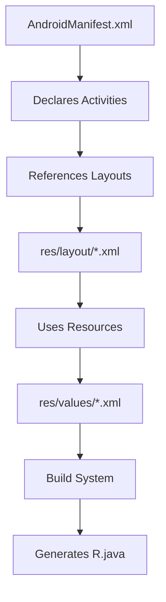

# Android Project Directory Structure

## Introduction

The Android project directory structure forms the backbone of every Android application, serving as the organizational framework that dictates where different components reside. This systematic arrangement is crucial for maintaining code integrity, managing resources efficiently, and ensuring smooth collaboration in professional development environments.

At its core, the directory structure separates concerns by categorizing files based on their purpose - source code, resources, configuration files, and build scripts. This separation enables developers to quickly locate components during debugging, feature implementation, or performance optimization. For students, mastering this structure is vital for exam scenarios involving project setup questions and practical implementation tasks.

Understanding the directory hierarchy becomes particularly important when working with Android's resource system, which requires specific file placements for automatic R.java generation. Proper organization also ensures compatibility with Android Studio's build system and Gradle configuration, directly impacting the app's compilation and deployment processes.

## Key Directory Components

### 1. Project Root Level

```
MyApp/
├── app/ # Main application module
├── build.gradle # Project-level build configuration
├── settings.gradle # Module inclusion settings
└── gradle/ # Gradle wrapper files
```

#### 1.1 build.gradle (Project Level)

```gradle
buildscript {
 repositories {
 google()
 mavenCentral()
 }
 dependencies {
 classpath 'com.android.tools.build:gradle:8.0.0'
 }
}

allprojects {
 repositories {
 google()
 mavenCentral()
 }
}
```

- **Purpose**: Configures build tools and repositories for all modules
- **Key Elements**:
- `buildscript`: Defines Gradle plugin version
- `allprojects`: Shared repository configuration

#### 1.2 settings.gradle

```gradle
include ':app'
rootProject.name = "MyApp"
```

- Specifies included modules (':app' for single-module projects)
- Sets root project name

### 2. App Module Structure

```
app/
├── manifests/
│ └── AndroidManifest.xml
├── java/
│ ├── com.example.myapp/
│ ├── (androidTest)/
│ └── (test)/
├── res/
│ ├── drawable/
│ ├── layout/
│ ├── mipmap/
│ ├── values/
│ └── ...
└── build.gradle
```

#### 2.1 AndroidManifest.xml

- Declares app components (activities, services)
- Specifies permissions and hardware requirements
- Sets application icon and theme

#### 2.2 Source Directories

- **main/java**: Primary Java/Kotlin source files
- **androidTest**: Instrumentation tests
- **test**: Unit tests

#### 2.3 Resource Directory (res/)

| Subdirectory | Content Type          | Example Files           |
| ------------ | --------------------- | ----------------------- |
| drawable/    | Images and shapes     | button_bg.xml           |
| layout/      | UI definitions        | activity_main.xml       |
| mipmap/      | Launcher icons        | ic_launcher.png         |
| values/      | Constants and styles  | strings.xml, colors.xml |
| raw/         | Arbitrary files       | config.json             |
| anim/        | Animation definitions | fade_in.xml             |

## Critical File Relationships



## Examples

### Example 1: Adding a New Activity

1. **Java File**: Create `MainActivity.java` in `app/src/main/java/com/example/myapp/`
2. **Layout XML**: Create `activity_main.xml` in `res/layout/`
3. **Manifest Entry**:

```xml
<activity android:name=".MainActivity">
 <intent-filter>
 <action android:name="android.intent.action.MAIN" />
 <category android:name="android.intent.category.LAUNCHER" />
 </intent-filter>
</activity>
```

### Example 2: Adding String Resources

1. Create/Modify `res/values/strings.xml`:

```xml
<resources>
 <string name="app_name">My Application</string>
 <string name="welcome_message">Hello Students!</string>
</resources>
```

2. Reference in Java:

```java
String welcome = getString(R.string.welcome_message);
```

3. Use in XML Layout:

```xml
<TextView
 android:text="@string/welcome_message"
 ... />
```

## Gradle Configuration Hierarchy

| File                | Scope   | Key Responsibilities                        |
| ------------------- | ------- | ------------------------------------------- |
| settings.gradle     | Project | Module inclusion, project name              |
| build.gradle (root) | Project | Common buildscript configuration            |
| build.gradle (app)  | Module  | Application-specific dependencies and build |

**Module-level build.gradle**:

```gradle
plugins {
 id 'com.android.application'
}

android {
 compileSdk 34

 defaultConfig {
 applicationId "com.example.myapp"
 minSdk 21
 targetSdk 34
 }
}

dependencies {
 implementation 'androidx.core:core-ktx:1.12.0'
 testImplementation 'junit:junit:4.13.2'
}
```

## Exam Tips

1. **Manifest File Priority**: Remember AndroidManifest.xml is the first file processed during build
2. **Resource Naming Rules**: Resources must use lowercase letters with underscores (my_icon.png)
3. **Build Configuration**:

- Project-level build.gradle: Affects all modules
- Module-level: App-specific settings

4. **Test Directories**:

- androidTest: Instrumentation tests requiring device
- test: Local unit tests

5. **Resource Qualification**:

- Use suffixes like -hdpi, -land for device-specific resources

6. **Gradle Wrapper**: Ensures consistent build environment through gradle-wrapper.properties
7. **R.java Generation**: Automatic file created from res/ directory contents

## Real-World Applications

1. **Multi-module Projects**: Large apps split into feature modules with similar structure
2. **Build Variants**: Debug/release configurations using src/debug/ and src/release/ directories
3. **Localization**: values-es/strings.xml for Spanish translations
4. **Device Adaptation**: layout-land/ for landscape orientations
5. **Vector Drawables**: XML-based images in drawable/ for resolution independence

## Common Mistakes to Avoid

1. Placing Java files in incorrect package directories
2. Using uppercase letters in resource filenames
3. Modifying auto-generated R.java file directly
4. Forgetting to update AndroidManifest.xml when adding new activities
5. Storing large files in res/raw/ instead of assets/
