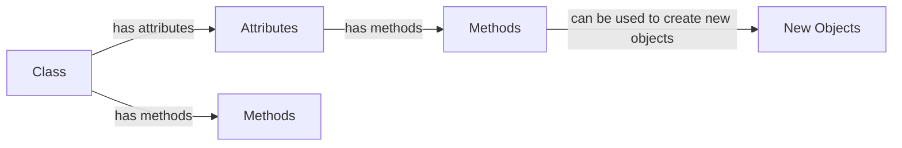

# Chapter 6: Introducing Classes in Java

=====================================

## Introduction

---

In the previous chapters, we have learned the basics of Java programming, including data types, operators, control structures, functions, and arrays. However, Java is an object-oriented programming language, which means that it organizes code into objects that contain data and functions that operate on that data. In this chapter, we will introduce the concept of classes, which is the foundation of object-oriented programming in Java.

## Historical Context

---

The concept of classes dates back to the early 20th century, when the Smalltalk programming language was developed. Smalltalk was designed to be an object-oriented language, and it introduced the concept of classes as a way to organize code into reusable units. The idea of classes was later adopted by other programming languages, including C++, Java, and many others.

## Class Fundamentals

---

In Java, a class is a blueprint or a template that defines the properties and behavior of an object. A class defines the following:

- **Attributes** (also known as data members): These are the data that are associated with an object. Attributes can be variables, constants, or even other classes.
- **Methods** (also known as functions): These are the actions that an object can perform. Methods can operate on the attributes of an object and can even create new objects.

### Class Declaration

A class in Java is declared using the `class` keyword followed by the name of the class. For example:

```java
public class Car {
    // class body
}
```

The `public` access modifier makes the class accessible to all parts of the program.

### Access Modifiers

Java provides several access modifiers that can be used to control the visibility of class members. The most common access modifiers are:

- **Public**: Accessible to all parts of the program.
- **Private**: Accessible only within the class itself.
- **Protected**: Accessible within the class and its subclasses.

### Class Body

The class body is where the attributes and methods of the class are defined. For example:

```java
public class Car {
    private String color;
    private int speed;

    public Car(String color, int speed) {
        this.color = color;
        this.speed = speed;
    }

    public void accelerate() {
        speed++;
    }

    public void brake() {
        speed--;
    }
}
```

In this example, we have defined two attributes: `color` and `speed`, which are private by default. We have also defined two methods: `accelerate()` and `brake()`.

## Declaring Objects

---

Once we have defined a class, we can declare an object of that class. An object is an instance of a class, and it has its own set of attributes and methods. To declare an object, we need to create an instance of the class using the `new` keyword. For example:

```java
Car myCar = new Car("red", 60);
```

In this example, we have declared an object called `myCar` of class `Car`.

## Assigning Object Reference Variables

---

An object reference variable is a variable that holds the memory address of an object. To assign an object reference variable to an object, we use the assignment operator (=). For example:

```java
Car myCar;
myCar = new Car("blue", 70);
```

In this example, we have declared an object reference variable called `myCar` and assigned it the value of a new `Car` object.

## Methods

---

Methods are actions that can be performed on an object. In Java, methods are defined inside a class and can access the attributes of the class. Methods can also create new objects and return them. For example:

```java
public class Car {
    private String color;
    private int speed;

    public Car(String color, int speed) {
        this.color = color;
        this.speed = speed;
    }

    public void accelerate() {
        speed++;
    }

    public Car accelerateCar() {
        accelerate();
        return new Car(color, speed);
    }
}
```

In this example, we have defined a method called `accelerateCar()` that calls the `accelerate()` method and then creates a new `Car` object and returns it.

## Case Study

---

Let's consider a simple case study to illustrate the concepts discussed in this chapter. Suppose we want to create a program that simulates a traffic light. We can define a class `TrafficLight` that represents the traffic light and its attributes, such as the color and the time left until the light changes.

```java
public class TrafficLight {
    private String color;
    private int timeLeft;

    public TrafficLight(String color, int timeLeft) {
        this.color = color;
        this.timeLeft = timeLeft;
    }

    public void changeColor() {
        if (color.equals("red")) {
            color = "green";
        } else if (color.equals("green")) {
            color = "yellow";
        } else if (color.equals("yellow")) {
            color = "red";
        }
        timeLeft = 5;
    }

    public void changeTimeLeft() {
        timeLeft++;
    }
}
```

We can then create an object of the `TrafficLight` class and use its methods to simulate the traffic light. For example:

```java
TrafficLight trafficLight = new TrafficLight("red", 5);
System.out.println("Initial color: " + trafficLight.color);
System.out.println("Initial time left: " + trafficLight.timeLeft);
```

This program will output:

```
Initial color: red
Initial time left: 5
```

We can then call the `changeColor()` method to change the color of the traffic light and the `changeTimeLeft()` method to increment the time left until the light changes.

```java
trafficLight.changeColor();
System.out.println("Updated color: " + trafficLight.color);
trafficLight.changeTimeLeft();
System.out.println("Updated time left: " + trafficLight.timeLeft);
```

This program will output:

```
Updated color: green
Updated time left: 6
```

This case study illustrates how classes can be used to represent real-world objects and how methods can be used to perform actions on those objects.

## Applications

---

Classes are widely used in many applications, including:

- **Operating Systems**: Classes are used to implement the operating system's kernel and device drivers.
- **Web Development**: Classes are used to implement the model-view-controller (MVC) pattern and to create reusable UI components.
- **Games**: Classes are used to implement game objects, such as characters and enemies.
- **Business Applications**: Classes are used to implement business logic and to create reusable components.

## Further Reading

---

- **"Head First Java" by Kathy Sierra and Bert Bates**: This book provides a comprehensive introduction to Java programming, including object-oriented programming concepts.
- **"Java: A Beginner's Guide" by Herbert Schildt**: This book provides a beginner's guide to Java programming, including object-oriented programming concepts.
- **"Object-Oriented Programming in Java" by Walter Savitch**: This book provides a comprehensive introduction to object-oriented programming in Java.

### Diagrams

Here is a diagram that illustrates the concept of classes and objects:



This diagram shows how a class has attributes and methods, and how these can be used to create new objects.

### Example Use Cases

Here are some example use cases for classes:

- **Simulating a Traffic Light**: We can simulate a traffic light by creating a class `TrafficLight` that represents the traffic light and its attributes, such as the color and the time left until the light changes.
- **Implementing a Game**: We can implement a game by creating classes for game objects, such as characters and enemies.
- **Creating a UI Component**: We can create a UI component by creating a class that represents the component and its attributes, such as the layout and the behavior.

### Best Practices

Here are some best practices for using classes:

- **Use meaningful names**: Use meaningful names for classes and attributes to make the code easier to understand.
- **Keep it simple**: Keep the class definition simple and focused on one job.
- **Use inheritance**: Use inheritance to create a hierarchy of classes and to reuse code.
