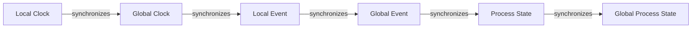

# **Global States in Distributed Systems**

## **Introduction**

In distributed systems, a global state refers to the current state of a system that is accessible to all nodes or processes within the system. It is a critical concept in understanding the behavior and coordination of distributed systems. In this section, we will delve into the concept of global states, their importance, and their implications in distributed systems.

## **Definition and Characteristics**

A global state is defined as the current state of a system that is accessible to all nodes or processes within the system. It is a snapshot of the system's state at a particular point in time. The characteristics of a global state include:

- **Accessibility**: A global state is accessible to all nodes or processes within the system.
- **Consistency**: A global state is consistent across all nodes or processes within the system.
- **Uniqueness**: A global state is unique and cannot be duplicated or modified independently by multiple nodes or processes.

## **Types of Global States**

There are several types of global states, including:

- **Weakly Consistent**: A weakly consistent global state is accessible to all nodes or processes within the system, but it may not be consistent across all nodes or processes.
- **Strongly Consistent**: A strongly consistent global state is accessible to all nodes or processes within the system and is consistent across all nodes or processes.
- **Eventual Consistency**: An eventual consistent global state is accessible to all nodes or processes within the system, but it may not be consistent across all nodes or processes at all times.

## **Clocks and Global States**

In distributed systems, clocks play a crucial role in determining the global state of a system. A clock is a measure of time that is used to synchronize the timing of events within a system. There are several types of clocks, including:

- **Local Clock**: A local clock is a clock that is used by a single node or process within a system.
- **Global Clock**: A global clock is a clock that is used by all nodes or processes within a system.
- **Distributed Clock**: A distributed clock is a clock that is used by multiple nodes or processes within a system.

## **Events and Global States**

In distributed systems, events play a crucial role in determining the global state of a system. An event is an occurrence that occurs within a system, such as a message being sent or a process being executed. There are several types of events, including:

- **Local Event**: A local event is an event that occurs within a single node or process within a system.
- **Global Event**: A global event is an event that occurs across all nodes or processes within a system.

## **Process States and Global States**

In distributed systems, process states play a crucial role in determining the global state of a system. A process state is the current state of a process within a system, such as running or stopped. There are several types of process states, including:

- **Local Process State**: A local process state is the current state of a process within a single node or process within a system.
- **Global Process State**: A global process state is the current state of a process across all nodes or processes within a system.

## **Applications and Case Studies**

Global states have numerous applications in distributed systems, including:

- **Distributed Transactions**: Global states are used to manage distributed transactions, which are transactions that involve multiple nodes or processes within a system.
- **Distributed Locks**: Global states are used to manage distributed locks, which are locks that are used to synchronize access to shared resources within a system.
- **Distributed Consensus**: Global states are used to manage distributed consensus, which is a protocol that ensures that all nodes or processes within a system agree on a particular value.

## **Historical Context and Modern Developments**

The concept of global states has been around for several decades, with the first implementations emerging in the 1970s. However, it wasn't until the 1990s that global states became a widely accepted concept in the field of distributed systems.

In recent years, there has been a significant amount of research focused on global states, particularly in the areas of distributed transactions and distributed consensus. This research has led to the development of new protocols and algorithms that are designed to manage global states in distributed systems.

## **Diagram Descriptions**

Here is a diagram that illustrates the concept of global states in a distributed system:

This diagram shows how a local clock synchronizes with a global clock, which in turn synchronizes with local events and global events, which ultimately synchronize with process states and global process states.

## **Further Reading**

For further reading on the topic of global states, we recommend the following textbooks:

- "Distributed Systems: Concepts and Design Principles" by George F. Coulouris, Jean Dollimore, and Tim Kindberg
- "Concurrent Programming: Principles and Practice" by Robert E. Tarjan
- "Distributed Systems: A Survey" by S. S. Iyengar and D. K. Pradhan

We also recommend the following research papers:

- "Distributed Transactions: A Definition and Analysis" by Leslie Lamport, Robert Shostak, and Marshall Pease
- "Distributed Locks: A Survey" by K. Maniar and S. S. Iyengar
- "Distributed Consensus: A Survey" by L. Lamport, R. Shostak, and M. Pease
