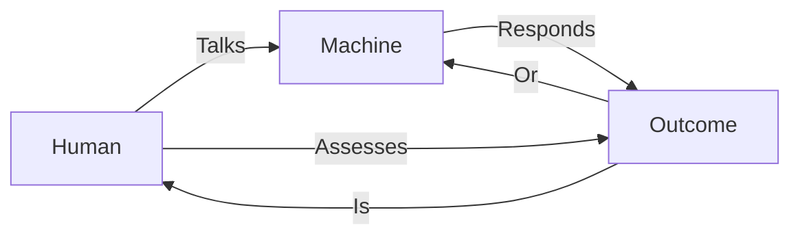
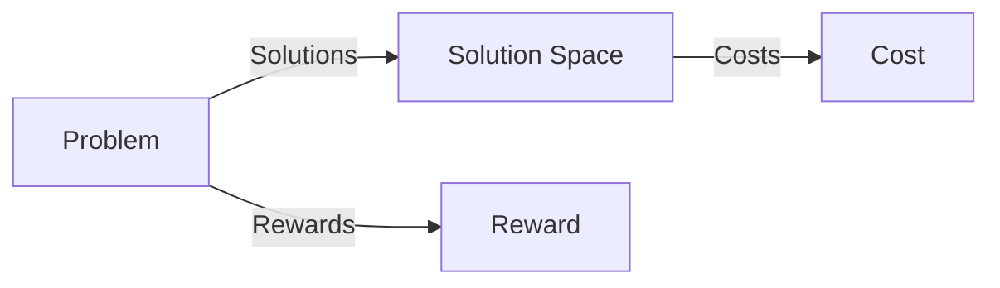
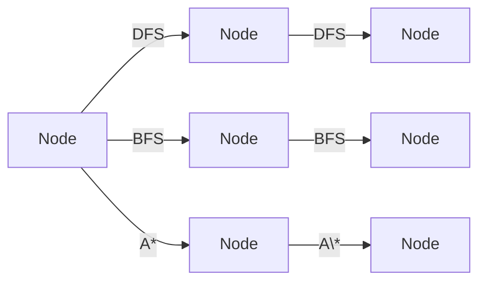

# Text Book 1: Chapter 1 - Introduction to Artificial Intelligence

===========================================================

## 1.1 Historical Context

---

Artificial intelligence (AI) has its roots in the 1950s, when computer scientists like Alan Turing, Marvin Minsky, and John McCarthy began exploring the possibility of creating machines that could think and learn like humans. The term "Artificial Intelligence" was first coined by John McCarthy in 1956, at the Dartmouth Summer Research Project on Artificial Intelligence.

Over the years, AI has evolved from a futuristic concept to a rapidly growing field with numerous applications in various industries. Today, AI is an integral part of our daily lives, from virtual assistants like Siri and Alexa to self-driving cars and medical diagnosis systems.

### 1.1.1 Turing Test

---

In 1950, Alan Turing proposed the Turing Test, a measure of a machine's ability to exhibit intelligent behavior equivalent to, or indistinguishable from, that of a human. The test involves a human evaluator engaging in natural language conversations with both a human and a machine, without knowing which is which. If the evaluator cannot reliably distinguish the machine from the human, the machine is said to have passed the Turing Test.

While the Turing Test is not a definitive measure of AI, it has become a benchmark for evaluating the success of AI systems in mimicking human intelligence.

### 1.1.2 Dartmouth Summer Research Project

---

In 1956, John McCarthy, Marvin Minsky, Nathaniel Rochester, and Claude Shannon met at Dartmouth College to discuss the possibilities of creating machines that could simulate human intelligence. This meeting marked the beginning of the field of Artificial Intelligence, and it laid the foundation for the development of AI research and applications.

## 1.2 What is Artificial Intelligence?

---

Artificial intelligence refers to the development of computer systems that can perform tasks that typically require human intelligence, such as:

- Reasoning and problem-solving
- Learning from data
- Perception and understanding of natural language
- Computer vision and image recognition

AI systems can be categorized into two main types:

- **Narrow or Weak AI**: Designed to perform a specific task, such as facial recognition or language translation.
- **General or Strong AI**: A hypothetical AI system that possesses human-like intelligence and can perform any intellectual task.

## 1.3 Problems, Problem Spaces, and Search

---

### 1.3.1 Problems

---

A problem is a well-defined question or task that requires a solution. In AI, problems can be classified into two categories:

- **Isolated problems**: Individual tasks that can be solved independently, such as playing chess or recognizing images.
- **Complex problems**: Large-scale problems that require the coordination of multiple tasks, such as planning or decision-making.

### 1.3.2 Problem Spaces

---

A problem space is a collection of possible solutions to a problem. It is a mathematical representation of the possible outcomes of a problem, including the costs or rewards associated with each solution.

### 1.3.3 Search

---

Search is a process of finding a solution to a problem by exploring the problem space. There are two main types of search:

- **Brute force search**: A trial-and-error approach that involves exhaustively searching the entire problem space.
- **Heuristic search**: A more efficient approach that uses heuristics (rules of thumb) to guide the search towards the most promising solutions.

## 1.4 Search Algorithms

---

There are several search algorithms that can be used to solve problems, including:

- **Depth-First Search (DFS)**: A recursive algorithm that explores the problem space depth-first, starting from a given node.
- **Breadth-First Search (BFS)**: An iterative algorithm that explores the problem space breadth-first, starting from a given node.
- **A\* Search**: A heuristic search algorithm that uses an admissible heuristic function to guide the search towards the most promising solutions.

### 1.4.1 DFS

---

DFS is a simple and intuitive search algorithm that is well-suited for solving problems with a small number of nodes. It works by recursively exploring each node in the problem space, starting from a given node.

### 1.4.2 BFS

---

BFS is a more efficient search algorithm that is well-suited for solving problems with a large number of nodes. It works by iteratively exploring each node in the problem space, starting from a given node.

### 1.4.3 A\* Search

---

A\* search is a heuristic search algorithm that uses an admissible heuristic function to guide the search towards the most promising solutions. It works by iteratively exploring each node in the problem space, starting from a given node, and selecting the node with the lowest estimated cost.

## 1.5 Applications of AI

---

AI has numerous applications in various industries, including:

- **Virtual assistants**: Virtual assistants like Siri and Alexa use AI to understand natural language and perform tasks.
- **Computer vision**: Computer vision systems use AI to recognize images and objects.
- **Robotics**: Robotics systems use AI to control and navigate robots.
- **Healthcare**: AI is used in healthcare to diagnose diseases and develop personalized treatment plans.

### 1.5.1 Case Study: Self-Driving Cars

---

Self-driving cars use AI to navigate roads and avoid obstacles. The system consists of several components, including:

- **Sensor suite**: A suite of sensors that detect the environment, such as cameras and lidar.
- **Computer vision**: AI algorithms that interpret the sensor data and recognize objects.
- **Machine learning**: AI algorithms that learn from experience and improve the system's performance.

## 1.6 Conclusion

---

In conclusion, artificial intelligence is a rapidly growing field with numerous applications in various industries. Understanding the concepts of AI, problems, problem spaces, and search is essential for developing intelligent systems that can solve real-world problems.

### 1.6.1 Further Reading

---

For further reading, we recommend the following texts:

- **"Artificial Intelligence: A Modern Approach" by Stuart Russell and Peter Norvig**: A comprehensive textbook that covers the basics of AI and its applications.
- **"Deep Learning" by Ian Goodfellow, Yoshua Bengio, and Aaron Courville**: A textbook that covers the basics of deep learning and its applications.
- **"The Elements of Computational Complexity" by Michael Sipser**: A textbook that covers the basics of computational complexity theory and its applications.

## Diagrams and Figures

---

### Figure 1.1: Turing Test

This diagram illustrates the Turing Test, where a human evaluator assesses the responses of a human and a machine to determine whether the machine is intelligent enough to exhibit human-like behavior.

### Figure 1.2: Problem Space

This diagram illustrates a problem space, where a problem is represented as a node, and the possible solutions are represented as a branch. The costs and rewards associated with each solution are represented as nodes.

### Figure 1.3: Search Algorithm

This diagram illustrates the search algorithm, where the problem space is traversed recursively or iteratively, depending on the search algorithm used.
