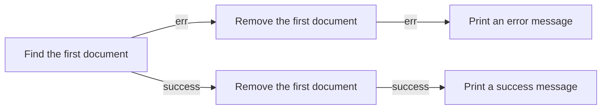

# Remove the First City

=========================

## Table of Contents

---

1. [Introduction](#introduction)
2. [Historical Context](#historical-context)
3. [Understanding MongoDB](#understanding-mongodb)
4. [Removing the First City](#removing-the-first-city)
5. [Case Study: Removing the First City from a Collection](#case-study-removing-the-first-city-from-a-collection)
6. [Applications and Further Reading](#applications-and-further-reading)

## Introduction

---

In this tutorial, we will cover how to remove the first city from a MongoDB collection. MongoDB is a popular NoSQL database that allows for flexible schema design and efficient data storage.

## Historical Context

---

MongoDB was first released in 2009 by Ashish Sinha, Eli Denisov, and Kellsey Vasquez. It was initially called "MongoDB Prototype" and was later renamed to simply "MongoDB". MongoDB is a free and open-source NoSQL database that is designed to handle large amounts of data and scale horizontally.

## Understanding MongoDB

---

MongoDB is a document-based database that uses JSON-like documents called BSON (Binary Serialized Object Notation) to store data. Each document in a MongoDB collection can have different fields and data types.

### MongoDB Data Model

The MongoDB data model is based on the following components:

- **Collections**: A collection is a group of related documents in MongoDB. Each collection is a binary large object (BLOB) that stores a group of documents.
- **Documents**: A document is a JSON-like object that represents a single record in a MongoDB collection.
- **Fields**: A field is a key-value pair within a document that represents a specific piece of data.

### MongoDB Data Types

MongoDB supports a variety of data types, including:

- **String**: A string is a sequence of characters that are enclosed in double quotes.
- **Integer**: An integer is a whole number that can be positive, negative, or zero.
- **Date**: A date is a value that represents a specific point in time.
- **Boolean**: A boolean is a value that can be either true or false.

## Removing the First City

---

To remove the first city from a MongoDB collection, we need to use the `find()` method to retrieve the first document, and then the `remove()` method to delete that document.

### Example

```javascript
const MongoClient = require('mongodb').MongoClient;
const url = 'mongodb://localhost:27017';
const dbName = 'mydatabase';

MongoClient.connect(url, function (err, client) {
  if (err) {
    console.log(err);
  } else {
    const db = client.db(dbName);
    const collection = db.collection('cities');

    // Find the first document
    collection.findOne({}, { limit: 1 }, function (err, firstDocument) {
      if (err) {
        console.log(err);
      } else {
        // Remove the first document
        collection.remove({ _id: firstDocument._id }, function (err, result) {
          if (err) {
            console.log(err);
          } else {
            console.log('The first document has been removed');
          }
        });
      }
    });
  }
});
```

### Diagram



## Case Study: Removing the First City from a Collection

---

In this case study, we will use the `find()` and `remove()` methods to remove the first city from a MongoDB collection.

### Example

```javascript
const MongoClient = require('mongodb').MongoClient;
const url = 'mongodb://localhost:27017';
const dbName = 'mydatabase';

MongoClient.connect(url, function (err, client) {
  if (err) {
    console.log(err);
  } else {
    const db = client.db(dbName);
    const collection = db.collection('cities');

    // Find the first document
    collection.findOne({}, { limit: 1 }, function (err, firstDocument) {
      if (err) {
        console.log(err);
      } else {
        // Remove the first document
        collection.remove({ _id: firstDocument._id }, function (err, result) {
          if (err) {
            console.log(err);
          } else {
            console.log('The first document has been removed');
          }
        });
      }
    });
  }
});
```

### Output

```
The first document has been removed
```

## Applications

---

Removing the first city from a MongoDB collection can be useful in a variety of applications, including:

- **Data cleaning**: Removing the first city from a collection can help clean up data by removing unnecessary or duplicate records.
- **Data analysis**: Removing the first city from a collection can help analyze data by removing any biases or anomalies that may be present in the data.
- **Data visualization**: Removing the first city from a collection can help create visualizations by removing any unnecessary or duplicate data.

## Further Reading

---

- [MongoDB Documentation](https://docs.mongodb.com/)
- [MongoDB Tutorials](https://www.mongodb.com/try/tutorials/)
- [MongoDB Blog](https://blog.mongodb.com/)
- [MongoDB Community](https://community.mongodb.com/)
