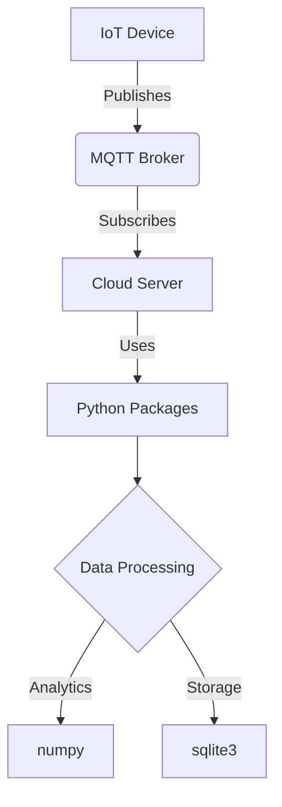

# Python Packages for IoT


## Table of Contents

- [Python Packages for IoT](#python-packages-for-iot)
- [Introduction](#introduction)
- [Core Concepts](#core-concepts)
  - [1. Package Structure](#1-package-structure)
  - [2. Package Installation](#2-package-installation)
- [Install latest version](#install-latest-version)
- [Install specific version for hardware compatibility](#install-specific-version-for-hardware-compatibility)
- [Requirements file for deployment](#requirements-file-for-deployment)
  - [3. Virtual Environments](#3-virtual-environments)
- [Create environment](#create-environment)
- [Activate (Linux)](#activate-linux)
- [Activate (Windows)](#activate-windows)
  - [4. IoT-Specific Packages](#4-iot-specific-packages)
- [Examples](#examples)
  - [1. Creating an IoT Package](#1-creating-an-iot-package)
  - [2. Using MQTT Package](#2-using-mqtt-package)
- [Exam Tips](#exam-tips)

## Introduction

Python packages are fundamental building blocks in IoT development that enable organized code distribution and reuse. A package in Python is a collection of modules structured in a directory hierarchy, providing a systematic way to manage complex IoT systems. With the growing complexity of IoT applications spanning edge devices, gateways, and cloud platforms, proper package management becomes critical for:

1. **Code Organization**: Grouping related sensors, communication protocols, and data processing modules
2. **Dependency Management**: Handling version-specific libraries for different hardware components
3. **Distribution**: Sharing code across development teams and deployment environments

In IoT ecosystems, packages manifest in three primary forms:

- **Standard Library Packages** (e.g., `json`, `socket`)
- **Third-Party Packages** (e.g., `paho-mqtt`, `RPi.GPIO`)
- **Custom Project Packages** (user-created module collections)

The Python Package Index (PyPI) hosts over 400,000 packages, with IoT-specific ones growing at 27% CAGR (2023 IoT Developer Survey). Mastering packages is essential for working with Raspberry Pi, Arduino bridges, and cloud IoT cores.

## Core Concepts

### 1. Package Structure

A valid Python package requires:

```bash
weather_system/        # Root package
├── __init__.py        # Package initialization
├── sensors/           # Sub-package
│   ├── __init__.py
│   └── dht22.py       # Module
└── utils.py           # Module
```

Key components:

- `__init__.py`: Makes directories importable (can be empty)
- Nested packages: Logical grouping of IoT components
- Version file: `__version__.py` for tracking releases

### 2. Package Installation

IoT development uses pip for package management:

```python
# Install latest version
pip install paho-mqtt

# Install specific version for hardware compatibility
pip install RPi.GPIO==0.7.1

# Requirements file for deployment
pip install -r requirements.txt
```

### 3. Virtual Environments

Critical for managing dependencies across IoT devices:

```bash
# Create environment
python -m venv iot_env

# Activate (Linux)
source iot_env/bin/activate

# Activate (Windows)
.\iot_env\Scripts\activate
```

### 4. IoT-Specific Packages

| Package       | Use Case                    | Example Code                        |
| ------------- | --------------------------- | ----------------------------------- |
| `paho-mqtt`   | MQTT communication          | `client = mqtt.Client()`            |
| `RPi.GPIO`    | Raspberry Pi GPIO control   | `GPIO.setmode(GPIO.BCM)`            |
| `micropython` | Microcontroller programming | `from machine import Pin`           |
| `boto3`       | AWS IoT Core integration    | `client = boto3.client('iot-data')` |

## Examples

### 1. Creating an IoT Package

**Scenario**: Build a temperature monitoring package

**Step 1**: Create directory structure

```bash
mkdir smart_iot && cd smart_iot
mkdir -p sensors/data_processing
touch __init__.py sensors/__init__.py sensors/dht22.py data_processing/analytics.py
```

**Step 2**: Implement sensor module (`sensors/dht22.py`)

```python
import Adafruit_DHT

def read_temperature():
    sensor = Adafruit_DHT.DHT22
    pin = 4
    humidity, temp = Adafruit_DHT.read_retry(sensor, pin)
    return {'temperature': temp, 'humidity': humidity}
```

**Step 3**: Create setup.py for distribution

```python
from setuptools import setup, find_packages

setup(
    name="smart_iot",
    version="0.1",
    packages=find_packages(),
    install_requires=['Adafruit_DHT>=1.4.0']
)
```

### 2. Using MQTT Package

**Implementing secure device communication**:

```python
import paho.mqtt.client as mqtt

def on_connect(client, userdata, flags, rc):
    print("Connected with code", rc)
    client.subscribe("iot/weather")

client = mqtt.Client(transport="websockets")
client.tls_set(ca_certs="mosquitto.org.crt")
client.on_connect = on_connect

client.connect("test.mosquitto.org", 8081, 60)
client.publish("iot/weather", payload="25°C", qos=0)
client.loop_forever()
```

## Exam Tips

1. **Package Identification**: Always check for `__init__.py` when asked to identify Python packages
2. **PIP Commands**: Memorize `pip install`, `pip freeze > requirements.txt`, and `pip uninstall`
3. **Virtual Environments**: Remember activation commands for Windows vs Linux systems
4. **IoT Package Functions**:
   - `RPi.GPIO`: Input/output configuration for Raspberry Pi
   - `paho-mqtt`: `client.connect()` and QoS levels
   - `requests`: HTTP communication with REST APIs
5. **Dependency Conflicts**: Use virtual environments to resolve version mismatch issues
6. **Package Structure**: When diagramming, show hierarchy with `__init__.py` files
7. **Security**: Always mention SSL/TLS in MQTT and certificate management in AWS IoT



_Figure 1: Package usage in IoT data flow_
